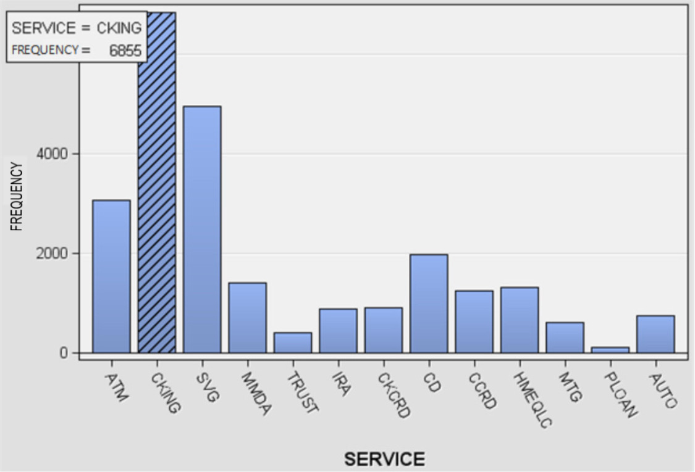
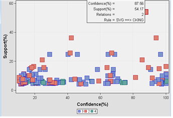
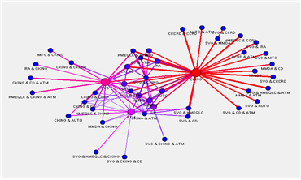
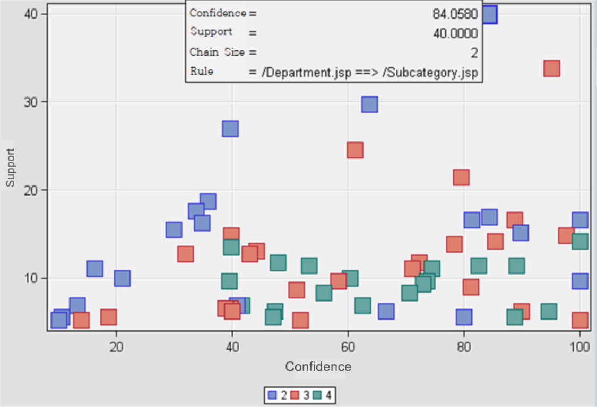
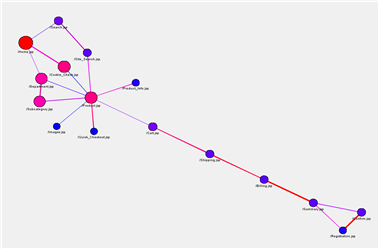

<link rel="stylesheet" href="styles.css" type="text/css">
<link rel="stylesheet" href="site_libs/academicons-1.9.1/css/academicons.min.css"/>

   

## **Bank Customer Behavior Analysis**

 

   

### 1. Introduction
 
Customer Relationship Management (CRM) leverages customer data to design strategies that improve decision-making and customer satisfaction. This project focuses on using Association Rule Discovery to uncover valuable insights such as Target Marketing, Churn Analysis, and Sales Forecasting.
   

### 2. Goal
 
This project aims to analyze bank customer data to uncover relationships between financial services using Association Rule Discovery and Path Analysis. The insights will support personalized product recommendations, enhancing customer satisfaction and loyalty.

  

### 3. Figure
 
**Case 1: Customer Subscription Patterns in Banking Services**
   
<h4>1-1. Research Subject</h4>
 
This analysis aims to identify the types of financial services that bank customers frequently subscribe to together.

- Dataset: BNKSERV  
- ACCT: Unique customer ID  
- SERVICE: Subscribed financial services  

The dataset includes 13 types of services offered, as detailed in the appendix.

  
<h4>1-2. Association Rule</h4>
 
The BNKSERV dataset was analyzed using Association Analysis, Graph Exploration, and Market Basket Analysis nodes.

  
<!-- Frequency1 -->

  
      

  [Fig. Frequency of Subscribed Services]
     

  

Graph Exploration :

- Each customer’s (ACCT) subscribed services are identified.  
- Among the services, CKING (Checking Account) had the highest subscription frequency, with a total of 6,855 occurrences.

   

<!-- confidence1 -->

  
      

  [Fig. Confidence vs. Support Scatter Plot for the Rule SVG → CKING]
     

  

Market Basket Analysis :

- CKING had the highest support of 85.7840%.
- The "Confidence vs. Support" graph from the association analysis revealed that the rule ‘SVG → CKING’ had both high confidence and support values.

   

<!-- network1 -->

  
      

  [Fig. Association Rule Network Graph]
     

  

Graph Representation of Rules :  

- Nodes represent transaction frequency (larger nodes = higher frequency).  
- Edge thickness indicates confidence (thicker edges = higher confidence).  
- CKING and SVG had the largest nodes, and CKING showed notably high confidence levels with other services.  

- Key Metrics for Rule SVG → CKING:  

- Transaction Count (\(n(\text{SVG}, \text{CKING})\)): 4,329  
- Support:  
  \[
  \text{Support} = \frac{4,329}{7,991} = 54.17\%
  \]
- Confidence:  
  \[
  \text{Confidence} = \frac{4,329}{4,944} = 87.56\%
  \]
- Lift:  
  \[
  \text{Lift} = \frac{87.56\%}{\frac{6,855}{7,991}} = 1.02
  \]

   

**Case 2: Web Visitor Behavior and Path Analysis**
   
<h4>2-1. Research Subject</h4>
 
This analysis examines website visitor behavior to identify:

- The number of visitors.
- The most and least viewed webpages.
- The webpages with the longest viewing durations.
 
Dataset:
The dataset, WEBPATH, consists of the following variables:

- REFERRER: Referrer source.
- REQUESTED_FILE: Webpage visited.
- SESSION_ID: Unique session identifier.
- SESSION_SEQUENCE: Order of webpage visits within the same session.

  
<h4>2-2. Path Analysis</h4>
 
The WEBPATH dataset was analyzed using Graph Exploration and Path Analysis nodes to uncover visitor behavior patterns.

  
<!-- confidence2 -->

  
      

  [Fig. Confidence vs. Support Scatter Plot for Association Rules]
     

  

Session Identification: Sessions were identified by combining session IDs and visit times.
  
"Confidence vs. Support" Graph:
  

- The rule ‘/Department.jsp → /Subcategory.jsp’ had the highest support (40.0%) and confidence (84.1%).

  
<!-- confidence2 -->

  
      

  [Fig. Path Analysis Network Graph]
     

  
Most Frequently Visited Webpage:
  

- ‘/Home.jsp’
- Visit count: 197
- Visit ratio: 67.9%

  
Path Representation of Rules:
  

- Nodes represent visit counts (larger nodes = higher counts).
- Edge thickness indicates confidence (thicker edges = higher confidence).
- ‘/Home.jsp’ had the largest node, while the strongest associations were:
- ‘/Billing.jsp ↔ /Summary.jsp’
- ‘/Registration.jsp → /Confirm.jsp’

  
- Key Metrics for Rule ‘/Department.jsp → /Subcategory.jsp’

- Transaction Count (n): 40  
- Support:  
  \[
  \text{Support} = \frac{40}{100} = 40.0\%
  \]  
- Confidence:  
  \[
  \text{Confidence} = \frac{40}{47.6} = 84.1\%
  \]  
- Lift: 
  \[
  \text{Lift} = \frac{84.1\%}{67.9\%} = 1.24
  \]

 

### 4. Methodology & Summary

This project used data-driven techniques to analyze customer behaviors and web visitor patterns, leveraging the following methodologies:
  

- Association Rule Discovery:
Applied to identify frequent patterns and relationships between subscribed financial services.
Metrics such as Support, Confidence, and Lift were used to evaluate the strength and significance of the discovered rules.

- Path Analysis:
Implemented to uncover visitor navigation patterns on the website.
Combined session data with sequence information to reveal key navigation paths and identify the most frequently visited pages.

- Visualization Techniques:
Graph Exploration nodes were used to visually represent relationships between entities, such as financial services and webpage navigation paths.
Network graphs highlighted significant nodes (e.g., frequently subscribed services or visited pages) and connections (e.g., transitions between pages or services).

   

### 5. Conclusion
  
Case 1: Banking Services

The analysis of customer subscription patterns revealed that CKING (Checking Account) is a central service with high demand, and its strong association with SVG (Savings Account) presents a valuable cross-selling opportunity. By targeting SVG customers with personalized CKING recommendations, banks can drive service adoption while enhancing customer loyalty. This approach can be further scaled using predictive analytics to identify other key service pairs, tailoring campaigns to maximize customer satisfaction and retention.

 
Case 2: Website Navigation

The path analysis identified ‘/Department.jsp → /Subcategory.jsp’ as a crucial navigation path with high confidence and support. This finding suggests an opportunity to improve website engagement through optimized page layouts and targeted content placement. Additionally, focusing on the most visited page, ‘/Home.jsp,’ as a central hub for user interaction could enhance navigation flow and reduce drop-off rates. Implementing real-time monitoring of navigation behavior could further refine user experiences, leading to higher conversion rates and improved audience retention.

