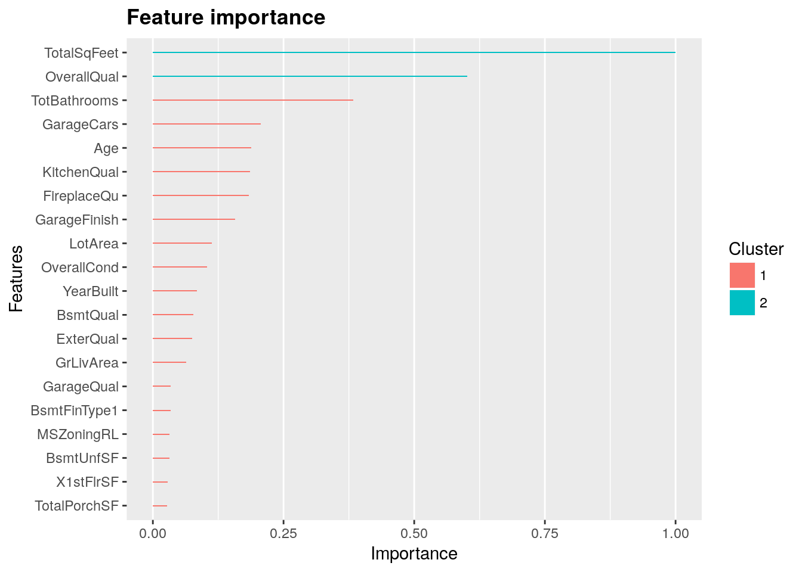

<link rel="stylesheet" href="styles.css" type="text/css">
<link rel="stylesheet" href="site_libs/academicons-1.9.1/css/academicons.min.css"/>

   

## **Bank Customer Behavior Analysis**

 

   

### 1. Introduction
 
The digital economy has led to the generation of vast amounts of data, offering opportunities for companies to predict customer behavior, enhance productivity, and innovate their business practices. In this environment, companies need to effectively manage resources while also improving product and service quality for customer satisfaction.  

Customer Relationship Management (CRM) emphasizes the importance of analyzing customer data to develop effective strategies. In this project, Association Rule Discovery is applied to identify key insights such as Target Marketing, Churn Analysis, and Sales Forecasting, supporting better decision-making and customer satisfaction.

   

### 2. Goal
 
The primary goal of this project is to analyze bank customer data using Association Rule Discovery and Path Analysis techniques to uncover the relationships between various financial services that customers subscribe to.  
By identifying these associations, the project aims to recommend additional financial products to customers, ultimately enhancing customer satisfaction and loyalty.

  

### 3. Figure

[Fig. LASSO regression features by importance]

 

### 4. Methodology & Summary

  + LASSO regressions showed the best performance with a cross validation RMSE-score of 0.1121. Although there is a lot of multicollinearity among the variables, LASSO regression include feature selection; it does not select a substantial number of the available variables in its model, as it is supposed to do.
  + The XGBoost model also performs very well with a cross validation RMSE of 0.1162.
  + As those two algorithms are very different, averaging predictions is likely to improve the predictions. As the Lasso cross validated RMSE is better than XGBoost's CV score, I decided to weight the Lasso results double.

 

### 5. Code

Please click [HERE](https://www.kaggle.com/erikbruin/house-prices-lasso-xgboost-and-a-detailed-eda/report) for the analysis report and code.

   

### 6. Conclusion

In this project, we successfully analyzed the engagement patterns of the "National Geographic" Facebook page through various text mining techniques. Key findings indicate a strong focus on wildlife photography and conservation. 
Future improvements could involve sentiment analysis to determine audience reactions and further investigation into time-based engagement trends.

