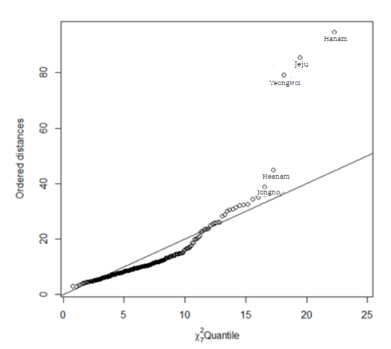
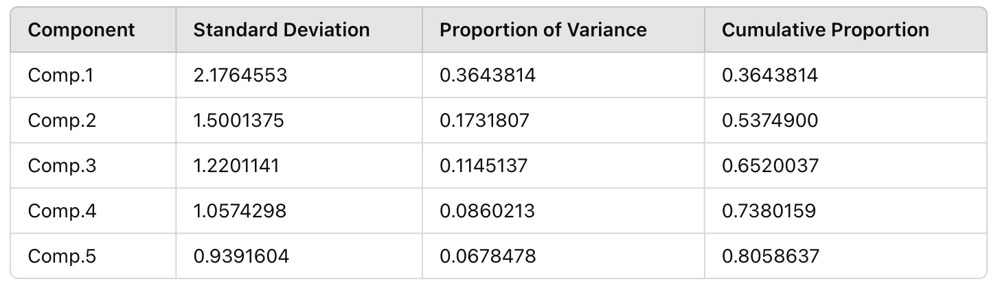

<style>
  body {
    font-family: Georgia, "Times New Roman", Times, serif;
  }

  h1, h2 {
    color: #333;
  }
</style>

<link rel="stylesheet" href="styles.css" type="text/css">
<link rel="stylesheet" href="site_libs/academicons-1.9.1/css/academicons.min.css"/>

<br><br><br>

## **Regional Birth Rate Disparities in South Korea**


<br>


<br><br><br>

### 1. Introduction
<br>
Birth rates in South Korea have reached historically low levels, posing significant social and economic challenges. Understanding the factors that influence regional birth rates is essential for developing effective policies to address this issue. This study explores the complex relationships between socio-economic, educational, welfare, and demographic variables affecting birth rates across different regions.
<br><br><br><br>


### 2. Goal
The primary objective of this study is to identify the key drivers of declining birth rates and uncover regional patterns using advanced statistical methods. By employing Principal Component Analysis (PCA), Factor Analysis, Cluster Analysis, and Multidimensional Scaling (MDS), this research aims to provide actionable insights for policymakers to design targeted interventions for increasing birth rates.

<br><br><br>

### 3. Analysis

<br><br>
Variable Descriptions :
<br><br>

**Dependent Variable**
<br><br>

- Total Fertility Rate :<br>
The average number of children a woman is expected to have during her lifetime. <br> Includes age-specific fertility rates (e.g., births per 1,000 women aged 15-19).

<br><br>

**Independent Variables**
<br><br>

Family Factors : <br>

- Crude Marriage Rate : Number of marriages per 1,000 population in a given year.<br>
- Crude Divorce Rate : Number of divorces per 1,000 population in a given year.
<br><br>

Social Factors : <br>

- Population of Marriageable Age Women : Population of women aged 30-34.<br>
- Average Age at First Marriage Female : Average age at first marriage by region.<br>
- EQ5D : Health-related quality of life index, where values closer to 1 indicate better quality.<br>
- Population Growth Rate : {(Population of comparison year - Population of base year) ÷ Population of base year} × 100.<br>
<br><br>

Educational Factors : <br>

- Number of Kindergartens : Total number of kindergartens in a region.<br>
- Number of Elementary Schools : Total number of elementary schools in a region.<br>
<br><br>

Welfare Factors : <br>

- Number of Childcare Facilities : Number of childcare facilities per 1,000 children aged 0-4.<br>
- Number of Cultural Facilities : Number of cultural facilities per 100,000 people.<br>
<br><br>

Economic Factors : <br>

- Fiscal Independence : Ratio of local taxes and non-tax revenue to the total budget. <br>
- Fiscal Autonomy : Ratio of self-generated revenue to the total budget.<br>


<br><br><br><br>
<h4> 1-1. Exploratory Data Analysis </h4>
<br>

1) Correlation by Domain
<br><br><br>

To understand the relationships between variables, correlation coefficients were calculated for each domain: social, family, education, welfare, and economy.
<br><br>

```r
birth = read.csv('birth.csv')
head(birth)
data = birth[,-1]

#Social Domain
round(cor(birth[, c("Average_Age_at_First_Marriage_Female","Population_of_Marriageable_Age_Women","Population_Growth_Rate","EQ5D")]), 4)

#Family Domain
round(cor(birth[, c("Marriage_Rate","Divorce_Rate")]), 2)

#Education Domain
round(cor(birth[, c("Number_of_Kindergartens", "Number_of_Elementary Schools")]))

#Welfare Domain
round(cor(birth[, c("Number_of_Cultural_Facilities", "Number_of_Childcare_Facilities")]))

#Economy Domain
round(cor(birth[, c("Fiscal_Independence", "Fiscal_Autonomy")]))

#Correlation Matrix
corr_matrix <- round(cor(birth), 2)
print(corr_matrix)
```

<br><br>
Below is a summary of key results:
<br><br>

- Social Domain <br>

The highest correlation was observed between Average Age at First Marriage Female and Population of Marriageable Age Women (correlation: 0.096). However, the correlation between Average Age at First Marriage Female and EQ5D (Quality of Life Index) was negligible. 
<br><br>

- Family Domain <br>

Crude Marriage Rate and Crude Divorce Rate showed a strong positive correlation (0.96). 
<br><br>

- Education Domain <br>

Number of Kindergartens and Number of Elementary Schools were strongly correlated (0.95).
<br><br>

- Welfare Domain <br>

Number of Cultural Facilities and Number of Childcare Facilities showed low correlation (-0.24).
<br><br>

- Economic Domain <br>

Fiscal Independence and Fiscal Autonomy had a moderate positive correlation (0.35).
<br><br>

- Correlation Matrix <br>

Some variables (e.g., Crude Marriage Rate and Population of Marriageable Age Women) showed moderate correlations, while others (e.g., Number of Kindergartens and Number of Elementary Schools) displayed stronger relationships.


<br><br><br>

2) Scatterplot Matrix

<br><br>

```r
pairs(test, panel = function (x, y, ...) { 
    points(x, y, ...)
    abline(lm(y ~ x), col = 'red')
}, cex = 1.5, pch = "*", bg = "blue",
    diag.panel = panel.hist, cex.labels = 1, font.labels = 1)
    
panel.hist <- function(x, ...) 
{
   usr <- par("usr"); on.exit(par(usr))
   par(usr = c(usr[1:2], 0, 1.5) )
   h <- hist(x, plot = FALSE)
   breaks <- h$breaks; nB <- length(breaks)
   y <- h$counts; y <- y/max(y)
   rect(breaks[-nB], 0, breaks[-1], y, col = "cyan", ...)
}
```

<br><br>

<!--Scatterplot Matrix-->
<p align="center">
  
    <br><br>
</p>
<p align="center" style="font-size: 14px; font-weight: bold;">
  [Fig. Scatterplot Matrix]
    <br>
</p>

<br><br>

The scatterplot matrix reveals a strong linear relationship between Total Fertility Rate and Average Age at First Marriage, as well as between Number of Kindergartens and Number of Elementary Schools. <br> 
<br>
However, Cultural Facilities show no notable linear relationship with other variables, suggesting they may not significantly contribute to explaining fertility rates. <br>
<br>
Additionally, the scatterplot matrix highlights the presence of outliers, indicating the need for further data preprocessing before re-evaluating the correlations and patterns.

<br><br><br><br>
3) Data Preprocessing

<br><br>

To analyze the dataset effectively, the normality of each variable was assessed, followed by the identification of noticeable outliers.

<br><br>

```r
layout(matrix(1:16, nc = 4)) 
sapply(colnames(data), function(x) {
        qqnorm(data[[x]], main = x, ) 
        qqline(data[[x]])
})
```
<br><br>

<!--Nornality(before)-->
<p align="center">
  
    <br><br>
</p>
<p align="center" style="font-size: 14px; font-weight: bold;">
  [Fig. Normality Check for Variables]
    <br>
</p>

<br><br>

The Q-Q plots revealed that most variables, except for Childcare Facilities, EQ5D, Average Age at First Marriage, Divorce Rate, Marriage Rate, and Total Fertility Rate, deviated from normality. <br> Additionally, many variables were found to have outliers.

<br><br>

To detect potential outliers, chi-square plots were generated for the dataset.

<br><br>

```r
x <- birth
cm <- colMeans(x)
S <- cov(x)
d <- apply(x, 1, function(x) {t(x-cm) %*% solve(S) %*% (x-cm)}) plot(qc <- qchisq((1:nrow(x) - 1/2) / nrow(x), df=7),
    sd <- sort(d),
    xlab = expression(paste(chi[7]^2, "Quantile")),
    ylab = "Ordered distances", xlim = range(qc) * c(1, 1.1))
oups <- which(rank(abs(qc - sd), ties = "random") > nrow(x) - 5) text(qc[oups], sd[oups] - 1.5, names(oups))
abline(a=0, b=1)
```
<br><br>

<!--chi-square-->
<p align="center">
  
    <br><br>
</p>
<p align="center" style="font-size: 14px; font-weight: bold;">
  [Fig. Chi-square Plot]
    <br>
</p>

<br><br>

The chi-square plot revealed that the data for Hanam-si (Gyeonggi-do), Jeju Special Self-Governing Province, Yeongwol-gun (Gangwon-do), Haenam-gun (Jeollanam-do), and Jongno-gu (Seoul) deviated significantly from the expected distribution.

<br><br><br>

<!--normality w/ outliers-->
<p align="center">
  
    <br><br>
</p>
<p align="center" style="font-size: 14px; font-weight: bold;">
  [Fig. Normality Check After Outlier Removal]
    <br>
</p>

<br><br>
After removing outliers, Q-Q plots were generated for each variable to assess normality.

<br><br><br><br>
4) Data Visualization

<br><br>

Scatterplots by Variable Categories
<br><br>
The full scatterplot matrix provides an overview of pairwise relationships across all variables. <br> Below, scatterplots are grouped by categories for clearer insights.

<br><br>

```r
family <- data[, c('Crude Marriage Rate', 'Crude Divorce Rate')] 
pairs(family, diag.panel=panel.hist,
   panel=function(x,y){
    data<-data.frame(cbind(x,y))
    par(new=TRUE) 
    den<-bkde2D(data,bandwidth=sapply(data,dpik)) 
    contour(x=den$x1,y=den$x2,
    z=den$fhat,axes=FALSE)
})
```
<br><br>

<!--scatterplot_family-->
<p align="center">
  
    <br><br>
</p>
<p align="center" style="font-size: 14px; font-weight: bold;">
  [Fig. Scatterplot for Family Factors]
    <br>
</p>

<br><br>

The results indicate that the family factors exhibit a single peak, making it difficult to distinguish between regions.

<br><br>

```r
education<-data[, c('Number of Kindergartens
','Number of Elementary Schools
')] 
pairs(education, diag.panel=panel.hist,
  panel=function(x,y){
    data<-data.frame(cbind(x,y))
    par(new=TRUE) 
    den<-bkde2D(data,bandwidth=sapply(data,dpik)) 
    contour(x=den$x1,y=den$x2,
    z=den$fhat,axes=FALSE)
})
```
<br><br>

<!--scatterplot_edu-->
<p align="center">
  
    <br><br>
</p>
<p align="center" style="font-size: 14px; font-weight: bold;">
  [Fig. Scatterplot for Education Factors]
    <br>
</p>

<br><br>

The results indicate that the education factors exhibit a single peak, making it difficult to differentiate between regions.

<br><br>

```r
society<- data[, c('Marriageable Age Women
','Average Age at First Marriage','EQ5D','Population Growth Rate')] pairs(society, diag.panel=panel.hist,
  panel=function(x,y){
    data<-data.frame(cbind(x,y))
    par(new=TRUE) 
    den<-bkde2D(data,bandwidth=sapply(data,dpik)) 
    contour(x=den$x1,y=den$x2,
    z=den$fhat,axes=FALSE)
})
```
<br><br>

<!--scatterplot_society-->
<p align="center">
  
    <br><br>
</p>
<p align="center" style="font-size: 14px; font-weight: bold;">
  [Fig. Scatterplot for Social Factors]
    <br>
</p>

<br><br>

The results indicate that the bivariate probability density related to women of marriageable age in the social factors shows two peaks, while the other variables in the social domain exhibit a single peak, making it difficult to distinguish between regions.

<br><br>

```r
welfare<-data[, c('Number of Childcare Facilities','Number of Cultural Facilities')] 
pairs(welfare, diag.panel=panel.hist,
  panel=function(x,y){
    data<-data.frame(cbind(x,y))
    par(new=TRUE) 
    den<-bkde2D(data,bandwidth=sapply(data,dpik)) 
    contour(x=den$x1,y=den$x2,
    z=den$fhat,axes=FALSE)
})
```
<br><br>

<!--scatterplot_welfare-->
<p align="center">
  
    <br><br>
</p>
<p align="center" style="font-size: 14px; font-weight: bold;">
  [Fig. Scatterplot for Welfare Factors]
    <br>
</p>

<br><br>

The results indicate that the welfare factors exhibit multiple peaks, allowing regions to be classified into several groups.

<br><br>

```r
economy<-data[, c('Fiscal Autonomy','Fiscal Independence')] 
pairs(economy, diag.panel=panel.hist,
  panel=function(x,y){
    data<-data.frame(cbind(x,y))
    par(new=TRUE) 
    den<-bkde2D(data,bandwidth=sapply(data,dpik)) 
    contour(x=den$x1,y=den$x2,
    z=den$fhat,axes=FALSE)
})
```
<br><br>

<!--scatterplot_economy-->
<p align="center">
  
    <br><br>
</p>
<p align="center" style="font-size: 14px; font-weight: bold;">
  [Fig. Scatterplot for Economy Factors]
    <br>
</p>

<br><br>

The results indicate that the economic factors exhibit multiple peaks, enabling regions to be classified into several groups.

<br><br><br><br>


<h4> 1-2. PCA </h4>

<br><br>

```r
birth = birth[-outcity,] 
round(cor(birth),2)

birth_corr = cor(birth) 
data_pcacor=princomp(covmat=birth_corr) 
summary(data_pcacor, loading=TRUE)

birth_corr = cor(test) 
data_pcacor=princomp(covmat=birth_corr) 
summary(data_pcacor, loading=TRUE)
```
<br><br>

<!--PCA-->
<p align="center">
  
    <br><br>
</p>
<p align="center" style="font-size: 14px; font-weight: bold;">
  [Fig. Importance of Principal Components]
    <br>
</p>

<br><br>

- Kaiser’s Rule: Principal components with eigenvalues less than 1 are excluded.<br>
- Cumulative Proportion: Principal components PC1, PC2, PC3, PC4, and PC5, which explain 70-80% of the variance, are selected.<br>
<br>
- To determine the number of principal components, the second method (cumulative proportion) was applied. <br><br> PC1 explains approximately 36% of the total variance, PC2 explains 17%, PC3 explains 11%, PC4 explains 9%, and PC5 explains 7%. <br><br> Together, these five components account for around 80% of the total variance, making them the optimal choice for analysis.


<br><br><br><br>

### 4. Code

Please click [HERE](https://www.kaggle.com/erikbruin/house-prices-lasso-xgboost-and-a-detailed-eda/report) for the analysis report and code.

<br>


