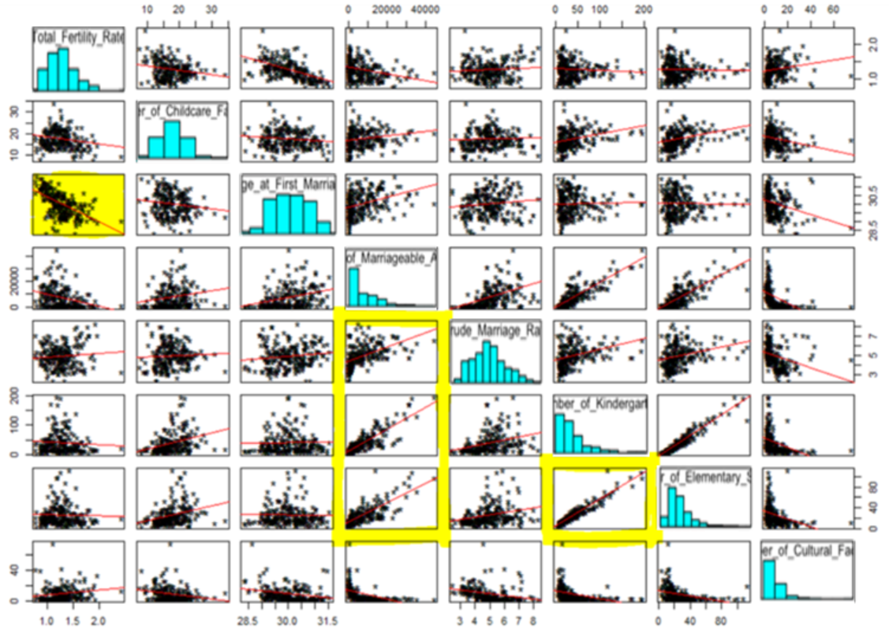
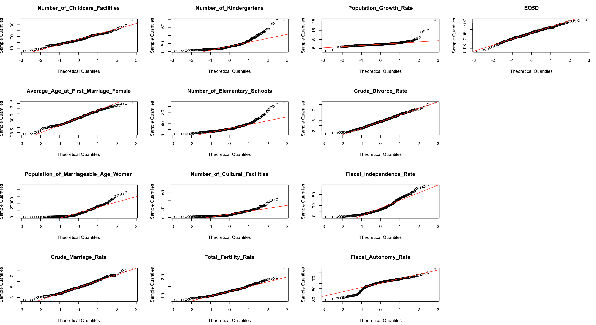
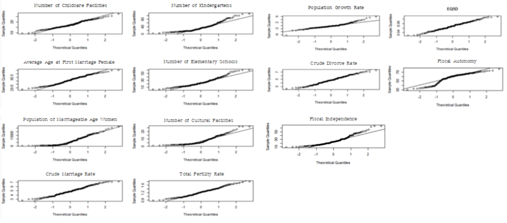
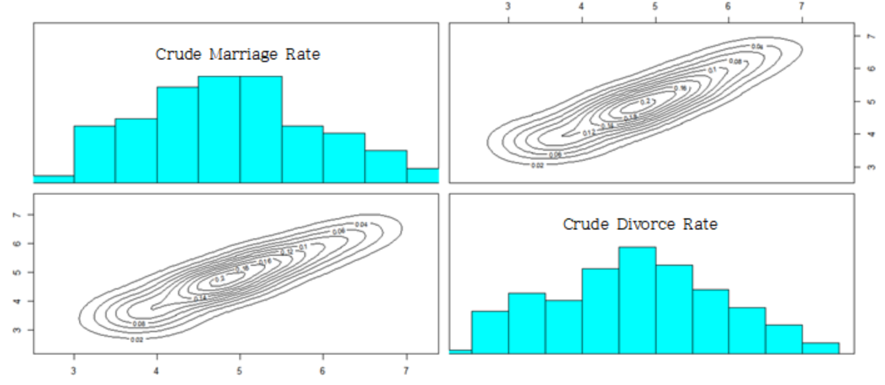
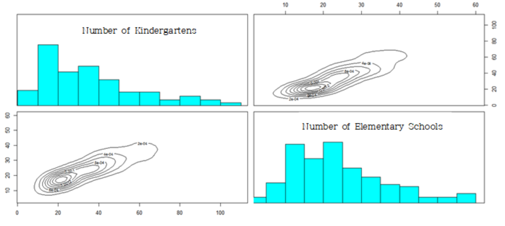
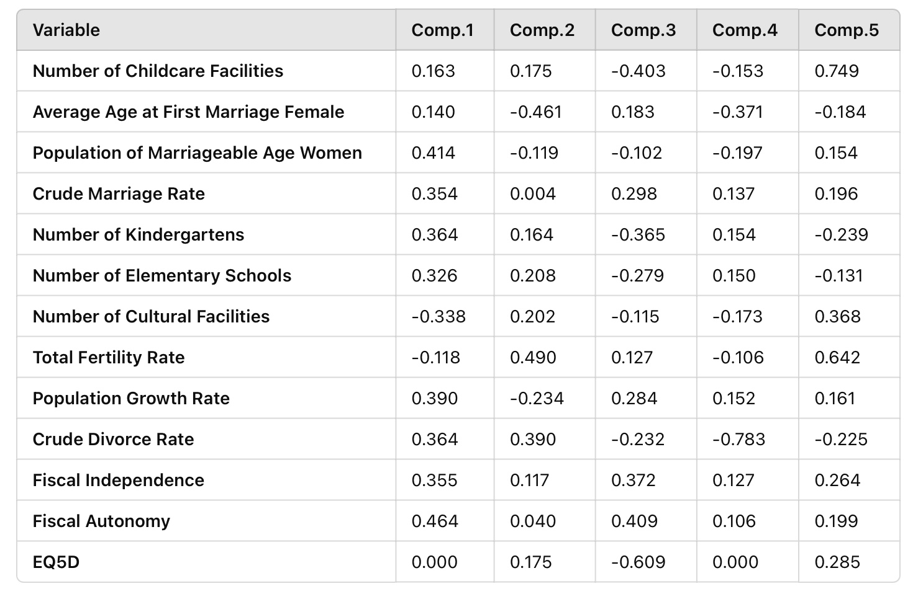
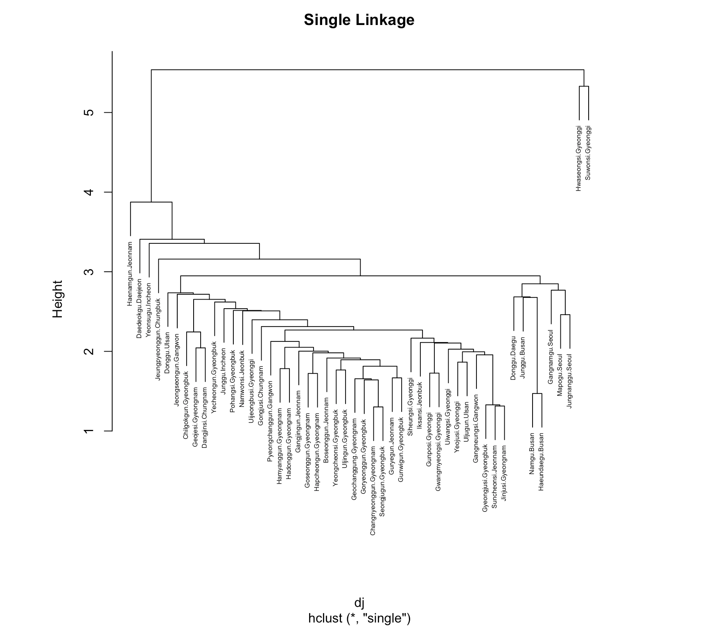
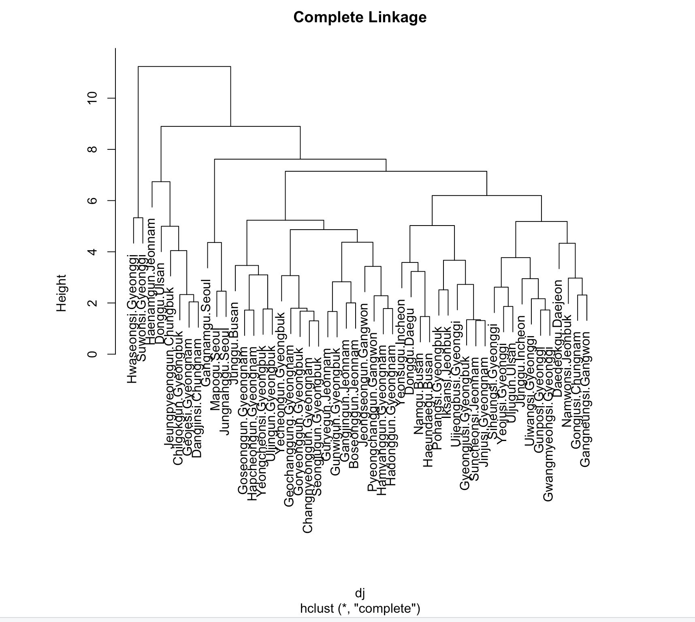
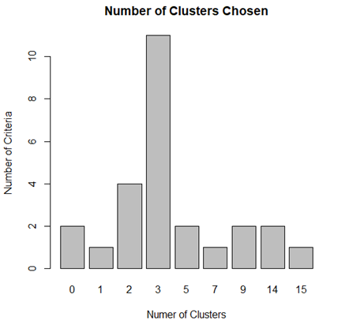

<style>
  body {
    font-family: Georgia, "Times New Roman", Times, serif;
  }

  h1, h2 {
    color: #333;
  }
</style>

<link rel="stylesheet" href="styles.css" type="text/css">
<link rel="stylesheet" href="site_libs/academicons-1.9.1/css/academicons.min.css"/>

<br><br><br>

## **Regional Birth Rate Disparities in South Korea**


<br>


<br><br><br>

### 1. Introduction
<br>
Birth rates in South Korea have reached historically low levels, posing significant social and economic challenges. Understanding the factors that influence regional birth rates is essential for developing effective policies to address this issue. This study explores the complex relationships between socio-economic, educational, welfare, and demographic variables affecting birth rates across different regions.
<br><br><br><br>


### 2. Goal
The primary objective of this study is to identify the key drivers of declining birth rates and uncover regional patterns using advanced statistical methods. By employing Principal Component Analysis (PCA), Factor Analysis, Cluster Analysis, and Multidimensional Scaling (MDS), this research aims to provide actionable insights for policymakers to design targeted interventions for increasing birth rates.

<br><br><br>

### 3. Analysis

<br><br>
Variable Descriptions :
<br><br>

**Dependent Variable**
<br><br>

- Total Fertility Rate :<br>
The average number of children a woman is expected to have during her lifetime. <br> Includes age-specific fertility rates (e.g., births per 1,000 women aged 15-19).

<br><br>

**Independent Variables**
<br><br>

Family Factors : <br>

- Crude Marriage Rate : Number of marriages per 1,000 population in a given year.<br>
- Crude Divorce Rate : Number of divorces per 1,000 population in a given year.
<br><br>

Social Factors : <br>

- Population of Marriageable Age Women : Population of women aged 30-34.<br>
- Average Age at First Marriage Female : Average age at first marriage by region.<br>
- EQ5D : Health-related quality of life index, where values closer to 1 indicate better quality.<br>
- Population Growth Rate : {(Population of comparison year - Population of base year) ÷ Population of base year} × 100.
<br><br>

Educational Factors : <br>

- Number of Kindergartens : Total number of kindergartens in a region.<br>
- Number of Elementary Schools : Total number of elementary schools in a region.
<br><br>

Welfare Factors : <br>

- Number of Childcare Facilities : Number of childcare facilities per 1,000 children aged 0-4.<br>
- Number of Cultural Facilities : Number of cultural facilities per 100,000 people.
<br><br>

Economic Factors : <br>

- Fiscal Independence : Ratio of local taxes and non-tax revenue to the total budget. <br>
- Fiscal Autonomy : Ratio of self-generated revenue to the total budget.<br>


<br><br><br><br>
<h4> 1-1. Exploratory Data Analysis </h4>
<br>

1) Correlation by Domain
<br><br><br>

To understand the relationships between variables, correlation coefficients were calculated for each domain: social, family, education, welfare, and economy.
<br><br>

```r
birth = read.csv('birth.csv')
head(birth)
data = birth[,-1]

#Social Domain
round(cor(birth[, c("Average_Age_at_First_Marriage_Female","Population_of_Marriageable_Age_Women","Population_Growth_Rate","EQ5D")]), 4)

#Family Domain
round(cor(birth[, c("Marriage_Rate","Divorce_Rate")]), 2)

#Education Domain
round(cor(birth[, c("Number_of_Kindergartens", "Number_of_Elementary Schools")]))

#Welfare Domain
round(cor(birth[, c("Number_of_Cultural_Facilities", "Number_of_Childcare_Facilities")]))

#Economy Domain
round(cor(birth[, c("Fiscal_Independence", "Fiscal_Autonomy")]))

#Correlation Matrix
corr_matrix <- round(cor(birth), 2)
print(corr_matrix)
```

<br><br>
Below is a summary of key results:
<br><br>

- Social Domain <br>

The highest correlation was observed between Average Age at First Marriage Female and Population of Marriageable Age Women (correlation: 0.096). However, the correlation between Average Age at First Marriage Female and EQ5D (Quality of Life Index) was negligible. 
<br><br>

- Family Domain <br>

Crude Marriage Rate and Crude Divorce Rate showed a strong positive correlation (0.96). 
<br><br>

- Education Domain <br>

Number of Kindergartens and Number of Elementary Schools were strongly correlated (0.95).
<br><br>

- Welfare Domain <br>

Number of Cultural Facilities and Number of Childcare Facilities showed low correlation (-0.24).
<br><br>

- Economic Domain <br>

Fiscal Independence and Fiscal Autonomy had a moderate positive correlation (0.35).
<br><br>

- Correlation Matrix <br>

Some variables (e.g., Crude Marriage Rate and Population of Marriageable Age Women) showed moderate correlations, while others (e.g., Number of Kindergartens and Number of Elementary Schools) displayed stronger relationships.


<br><br><br>

2) Scatterplot Matrix

<br><br>

```r
pairs(test, panel = function (x, y, ...) { 
    points(x, y, ...)
    abline(lm(y ~ x), col = 'red')
}, cex = 1.5, pch = "*", bg = "blue",
    diag.panel = panel.hist, cex.labels = 1, font.labels = 1)
    
panel.hist <- function(x, ...) 
{
   usr <- par("usr"); on.exit(par(usr))
   par(usr = c(usr[1:2], 0, 1.5) )
   h <- hist(x, plot = FALSE)
   breaks <- h$breaks; nB <- length(breaks)
   y <- h$counts; y <- y/max(y)
   rect(breaks[-nB], 0, breaks[-1], y, col = "cyan", ...)
}
```

<br><br>

<!--Scatterplot Matrix-->
<p align="center">
  
    <br><br>
</p>
<p align="center" style="font-size: 14px; font-weight: bold;">
  [Fig. Scatterplot Matrix]
    <br>
</p>

<br><br>

The scatterplot matrix reveals a strong linear relationship between Total Fertility Rate and Average Age at First Marriage, as well as between Number of Kindergartens and Number of Elementary Schools. <br> 
<br>
However, Cultural Facilities show no notable linear relationship with other variables, suggesting they may not significantly contribute to explaining fertility rates. <br>
<br>
Additionally, the scatterplot matrix highlights the presence of outliers, indicating the need for further data preprocessing before re-evaluating the correlations and patterns.

<br><br><br><br>
3) Data Preprocessing

<br><br>

To analyze the dataset effectively, the normality of each variable was assessed, followed by the identification of noticeable outliers.

<br><br>

```r
layout(matrix(1:16, nc = 4)) 
sapply(colnames(data), function(x) {
        qqnorm(data[[x]], main = x, ) 
        qqline(data[[x]])
})
```
<br><br>

<!--Nornality(before)-->
<p align="center">
  
    <br><br>
</p>
<p align="center" style="font-size: 14px; font-weight: bold;">
  [Fig. Normality Check for Variables]
    <br>
</p>

<br><br>

The Q-Q plots revealed that most variables, except for Childcare Facilities, EQ5D, Average Age at First Marriage, Divorce Rate, Marriage Rate, and Total Fertility Rate, deviated from normality. <br> Additionally, many variables were found to have outliers.

<br><br>

To detect potential outliers, chi-square plots were generated for the dataset.

<br><br>

```r
x <- birth
cm <- colMeans(x)
S <- cov(x)
d <- apply(x, 1, function(x) {t(x-cm) %*% solve(S) %*% (x-cm)}) plot(qc <- qchisq((1:nrow(x) - 1/2) / nrow(x), df=7),
    sd <- sort(d),
    xlab = expression(paste(chi[7]^2, "Quantile")),
    ylab = "Ordered distances", xlim = range(qc) * c(1, 1.1))
oups <- which(rank(abs(qc - sd), ties = "random") > nrow(x) - 5) text(qc[oups], sd[oups] - 1.5, names(oups))
abline(a=0, b=1)
```
<br><br>

<!--chi-square-->
<p align="center">
  
    <br><br>
</p>
<p align="center" style="font-size: 14px; font-weight: bold;">
  [Fig. Chi-square Plot]
    <br>
</p>

<br><br>

The chi-square plot revealed that the data for Hanam-si (Gyeonggi-do), Jeju Special Self-Governing Province, Yeongwol-gun (Gangwon-do), Haenam-gun (Jeollanam-do), and Jongno-gu (Seoul) deviated significantly from the expected distribution.

<br><br><br>

<!--normality w/ outliers-->
<p align="center">
  
    <br><br>
</p>
<p align="center" style="font-size: 14px; font-weight: bold;">
  [Fig. Normality Check After Outlier Removal]
    <br>
</p>

<br><br>
After removing outliers, Q-Q plots were generated for each variable to assess normality.

<br><br><br><br>
4) Data Visualization

<br><br>

Scatterplots by Variable Categories
<br><br>
The full scatterplot matrix provides an overview of pairwise relationships across all variables. <br> Below, scatterplots are grouped by categories for clearer insights.

<br><br>

```r
family <- data[, c('Crude Marriage Rate', 'Crude Divorce Rate')] 
pairs(family, diag.panel=panel.hist,
   panel=function(x,y){
    data<-data.frame(cbind(x,y))
    par(new=TRUE) 
    den<-bkde2D(data,bandwidth=sapply(data,dpik)) 
    contour(x=den$x1,y=den$x2,
    z=den$fhat,axes=FALSE)
})
```
<br><br>

<!--scatterplot_family-->
<p align="center">
  
    <br><br>
</p>
<p align="center" style="font-size: 14px; font-weight: bold;">
  [Fig. Scatterplot for Family Factors]
    <br>
</p>

<br><br>

The results indicate that the family factors exhibit a single peak, making it difficult to distinguish between regions.

<br><br>

```r
education<-data[, c('Number of Kindergartens
','Number of Elementary Schools
')] 
pairs(education, diag.panel=panel.hist,
  panel=function(x,y){
    data<-data.frame(cbind(x,y))
    par(new=TRUE) 
    den<-bkde2D(data,bandwidth=sapply(data,dpik)) 
    contour(x=den$x1,y=den$x2,
    z=den$fhat,axes=FALSE)
})
```
<br><br>

<!--scatterplot_edu-->
<p align="center">
  
    <br><br>
</p>
<p align="center" style="font-size: 14px; font-weight: bold;">
  [Fig. Scatterplot for Education Factors]
    <br>
</p>

<br><br>

The results indicate that the education factors exhibit a single peak, making it difficult to differentiate between regions.

<br><br>

```r
society<- data[, c('Marriageable Age Women
','Average Age at First Marriage','EQ5D','Population Growth Rate')] pairs(society, diag.panel=panel.hist,
  panel=function(x,y){
    data<-data.frame(cbind(x,y))
    par(new=TRUE) 
    den<-bkde2D(data,bandwidth=sapply(data,dpik)) 
    contour(x=den$x1,y=den$x2,
    z=den$fhat,axes=FALSE)
})
```
<br><br>

<!--scatterplot_society-->
<p align="center">
  
    <br><br>
</p>
<p align="center" style="font-size: 14px; font-weight: bold;">
  [Fig. Scatterplot for Social Factors]
    <br>
</p>

<br><br>

The results indicate that the bivariate probability density related to women of marriageable age in the social factors shows two peaks, while the other variables in the social domain exhibit a single peak, making it difficult to distinguish between regions.

<br><br>

```r
welfare<-data[, c('Number of Childcare Facilities','Number of Cultural Facilities')] 
pairs(welfare, diag.panel=panel.hist,
  panel=function(x,y){
    data<-data.frame(cbind(x,y))
    par(new=TRUE) 
    den<-bkde2D(data,bandwidth=sapply(data,dpik)) 
    contour(x=den$x1,y=den$x2,
    z=den$fhat,axes=FALSE)
})
```
<br><br>

<!--scatterplot_welfare-->
<p align="center">
  
    <br><br>
</p>
<p align="center" style="font-size: 14px; font-weight: bold;">
  [Fig. Scatterplot for Welfare Factors]
    <br>
</p>

<br><br>

The results indicate that the welfare factors exhibit multiple peaks, allowing regions to be classified into several groups.

<br><br>

```r
economy<-data[, c('Fiscal Autonomy','Fiscal Independence')] 
pairs(economy, diag.panel=panel.hist,
  panel=function(x,y){
    data<-data.frame(cbind(x,y))
    par(new=TRUE) 
    den<-bkde2D(data,bandwidth=sapply(data,dpik)) 
    contour(x=den$x1,y=den$x2,
    z=den$fhat,axes=FALSE)
})
```
<br><br>

<!--scatterplot_economy-->
<p align="center">
  
    <br><br>
</p>
<p align="center" style="font-size: 14px; font-weight: bold;">
  [Fig. Scatterplot for Economy Factors]
    <br>
</p>

<br><br>

The results indicate that the economic factors exhibit multiple peaks, enabling regions to be classified into several groups.

<br><br><br><br>


<h4> 1-2. PCA </h4>

<br><br>

```r
birth = birth[-outcity,] 
round(cor(birth),2)

birth_corr = cor(birth) 
data_pcacor=princomp(covmat=birth_corr) 
summary(data_pcacor, loading=TRUE)

birth_corr = cor(test) 
data_pcacor=princomp(covmat=birth_corr) 
summary(data_pcacor, loading=TRUE)
```
<br><br>

<!--PCA-->
<p align="center">
  
    <br><br>
</p>
<p align="center" style="font-size: 14px; font-weight: bold;">
  [Fig. Importance of Principal Components]
    <br>
</p>

<br><br>

- Kaiser’s Rule: Principal components with eigenvalues less than 1 are excluded.<br>
- Cumulative Proportion: Principal components PC1, PC2, PC3, PC4, and PC5, which explain 70-80% of the variance, are selected.<br>
<br>
- To determine the number of principal components, the second method (cumulative proportion) was applied. <br><br> PC1 explains approximately 36% of the total variance, PC2 explains 17%, PC3 explains 11%, PC4 explains 9%, and PC5 explains 7%. <br><br> Together, these five components account for around 80% of the total variance, making them the optimal choice for analysis.

<br><br>

**Principal Component Naming**

<br><br>

<!--PCA-->
<p align="center">
  
    <br><br>
</p>
<p align="center" style="font-size: 14px; font-weight: bold;">
  [Fig. Principal Component Loadings by Variables]
    <br>
</p>

<br><br>

Based on the results of the principal component analysis, the components were named as follows:
<br><br>

- **PC1 (*Urban Development Index*)**: Named due to the high loadings of variables such as *Population of Marriageable Age Women*, *Number of Cultural Facilities*, and *Fiscal Independence*. <br><br>
- **PC2 (*Demographic Factors*)**: Includes variables like *Average Age at First Marriage Female*, *Total Fertility Rate*, and *Population Growth Rate*. <br><br>
- **PC3 (*Households with Children*)**: Comprised of variables such as *Number of Childcare Facilities*, *Number of Elementary Schools*, *Crude Marriage Rate*, and *Crude Divorce Rate*. <br><br>
- **PC4**: Named after *EQ5D*, as it had the highest loading.<br><br>
- **PC5**: Named *Fiscal Autonomy* due to the dominant influence of this variable. 

<br><br><br><br>


<h4> 1-2. MDS </h4>

<br><br>

1) Data Validation
<br><br>

- The Euclidean distance matrix was created, and classical MDS was applied to determine how well the distances could be reconstructed in 12 dimensions.<br>
- The first 12 eigenvalues were non-zero, confirming that the Euclidean distance matrix can be accurately represented in 12 dimensions. <br>
- The maximum difference between the original distance matrix and the reconstructed matrix was \(3.29 \times 10^{-5}\), indicating minimal error.  <br>
- A comparison with principal component analysis (PCA) showed a maximum difference of \(9.76 \times 10^{-7}\), confirming high similarity.
<br><br><br><br>

2) Validation of MDS Results
<br>

- Most eigenvalues obtained from classical MDS were negative.  <br>
- This suggests that non-metric MDS may be more appropriate for this dataset.
<br><br><br><br>

3) Non-metric Multidimensional Scaling (Non-metric MDS)
<br><br><br>

```r
library("MASS")

(data_mds3 = isoMDS(D))
x = data_mds3$points[, 1]
y = data_mds3$points[, 2]
lim = range(c(x, y)) * 1.2
plot(x, y, xlab = "Coordinate 1", ylab = "Coordinate 2",
, ylim = c(-50,50),type = "n")
text(x, y, rownames(test), cex = 0.7,col = c("blue","black")[data$city])
```
<br><br>

<!--Non-metric MDS-->
<p align="center">
  
    <br><br>
</p>
<p align="center" style="font-size: 14px; font-weight: bold;">
  [Fig. Non-metric Multidimensional Scaling]
    <br>
</p>

<br><br>

The results of the non-metric multidimensional scaling (Non-metric MDS) indicate a clear distinction between the Seoul-Incheon region and other regions.


<br><br><br><br>

<h4> 1-3. Factor Analysis </h4>

<br><br>

Variables with *uniqueness values greater than 0.5* were identified. These variables (*Number of Childcare Facilities*, *Number of Cultural Facilities*, *Population Growth Rate*, and *EQ5D*) were excluded from the analysis.

<br><br>

```r
sapply(1:4, function(f)
factanal(scale(data) ,factors=f , method="mle")$PVAL)

(scores <- factanal(scale(data), factors = 4 method ="mle",scores = "regression")$scores)
factanal(scale(data), factors = 3, method ="mle")

birth_fit<-birth[,-c(1,7,8,13)] 
birthfit_cor<-cor(test_fit) 
sapply(1:4, function(f)
    factanal(birthfit_cor ,factors=f , method="mle")$PVAL)

scores<-factanal(scale(test_fit),factors=4,method='mle',scores='regression')$scores factanal(covmat=testfit_cor,factors=4,method='mle',n.obs=221)

```
<br><br><br>

| Variable                              | Factor 1 | Factor 2 | Factor 3 | Factor 4 |
|---------------------------------------|----------|----------|----------|----------|
| Average Age at First Marriage Female | -        | -        | -0.131   | **0.799** |
| Population of Marriageable Age Women | **0.810**| 0.333    | -        | 0.348    |
| Crude Marriage Rate                   | 0.191    | **0.938**| -        | -        |
| Number of Childcare Facilities        | **0.985**| 0.148    | -        | -        |
| Number of Elementary Schools          | **0.947**| 0.110    | -        | -        |
| Population Growth Rate                | -        | 0.345    | 0.328    | -        |
| Crude Divorce Rate                    | 0.195    | **0.966**| -        | 0.152    |
| Fiscal Independence                   | 0.454    | 0.485    | 0.533    | 0.402    |
| Fiscal Autonomy                       | -        | -        | **0.800**| -0.138   |

<br><br>
Based on the absolute factor loadings, the following groups were identified:
<br><br>

1. **Parents of Young Children** : This group includes variables such as *Population of Marriageable Age Women*, *Number of Kindergartens*, and *Number of Elementary Schools*. <br><br>
2. **Marital Status** : This group consists of *Crude Marriage Rate* and *Crude Divorce Rate*. <br><br>
3. **Urban Fiscal Capacity** : This group is defined by *Fiscal Independence* and *Fiscal Autonomy*. <br><br>
4. **Age at First Marriage for Women** : This group is represented by the variable *Average Age at First Marriage Female*, which showed a high loading.


<br><br><br><br>

<h4> 1-4. Cluster Analysis </h4>

<br><br>

1) **Agglomerative Hierarchical Clustering**

<br><br>

```r
birth = birth[, -1]
X <- scale(birth[, names(birth)])
dj <- dist(x)

plot(cc <- hclust(dj, method = "single"), main = "single")
plot(cc <- hclust(dj, method = "complete"), main = "complete")
plot(cc <- hclust(dj, method = "average"), main = "average")

```
<br><br>

<!--single linkage-->
<p align="center">
  
    <br><br>

<!--complete linkage-->
<p align="center">
  
    <br><br>

<!--average linkage-->
<p align="center">
  
    <br><br>
    
<br><br>
Agglomerative Hierarchical Clustering was applied using three methods:<br>
Single Linkage, Complete Linkage, and Average Linkage, to observe how the data is hierarchically classified. <br><br>
The results showed that the Complete Linkage Method divided the data into two major clusters. <br><br>
To understand the criteria for these clusters, the data will be analyzed by region.

<br><br><br>

```r
pr <- prcomp(dj)$x[, 1:2]

plot(pr, pch=(1:2)[cutree(cs, k=2)], col = c("red", "black")[test$city], xlim = range(pr) * c(0.9, 1.5))


legend("topright", col = c("red", "red", "black", "black"), legend = c("1/no", "2/no", "1/yes", "2/yes"), pch = c(1:2, 1:2), title="Cluster/city", bty="n")

```
<br><br>

<!--cluster_plot-->
<p align="center">
  
    <br><br>
</p>
<p align="center" style="font-size: 14px; font-weight: bold;">
  [Fig. Cluster Distribution by Region (PC1 vs. PC2)]
    <br>
</p>

<br><br>

The results show the data projected onto the first two principal component spaces. <br><br> The shape of the points represents the two clusters (1 and 2), while the colors indicate the values of the city variable (metropolitan and provincial areas vs. non-metropolitan areas). <br> The division along the first principal component is influenced by the fact that it represents "Urban Development." <br><br> However, this distinction is not perfectly clear.
<br><br>

- city = yes: Seoul, Busan, Daegu, Incheon, Gwangju, Daejeon, Ulsan, and Gyeonggi Province <br>
- city = no: All other regions.

<br><br><br><br>

2) **K-Means Clustering**

<br><br>

```r
wssplot <- function(data, nc=15, seed=1234){ 
 wss <- (nrow(data)-1)*sum(apply(data, 2, var)) 
 for (i in 2:nc){
    set.seed(seed)
    wss[i] <- sum(kmeans(data, centers=i)$withinss)}
    
 plot(1:nc, wss, type="b", xlab="Number of Clusters", ylab="Within groups sum of squares")}
 
wssplot(training.data)

```
<br><br>

<!--kmean-->
<p align="center">
  
    <br><br>
</p>
<p align="center" style="font-size: 14px; font-weight: bold;">
  [Fig. K-Means Clustering]
    <br>
</p>

<br><br>

To perform K-Means Clustering, the number of groups must be specified. The "elbow" method is used by plotting the within-cluster sum of squares (WCSS) to determine the optimal number of clusters. In the graph, the "elbow" appears between 2 and 4 clusters. Therefore, K-Means Clustering will be conducted with 2 clusters.

<br><br>

```r
round( sapply(birth, var), digits=1)

rge <- sapply(birth, function(x) diff(range(x))) 
birth_s <- sweep(birth, 2, rge, FUN = "/") 
round( sapply(birth_s, var), digits=5) 
kmeans(birth_s, centers = 2)$centers * rge

birth_pca <- prcomp(birth_s)
plot(birth_pca$x[, 1:2], pch = kmeans(birth_s, centers = 2)$cluster)

```
<br><br>

<!--birthplot-->
<p align="center">
  
    <br><br>
</p>
<p align="center" style="font-size: 14px; font-weight: bold;">
  [Fig. Scatter Plot of PC1 vs. PC2]
    <br>
</p>

<br><br>

The plot above illustrates the two-group solution in the first two principal component spaces derived from the correlation matrix. Similar to the results of the Agglomerative Hierarchical Clustering, the two groups are well separated along the first principal component score, representing "Urban Development."

<br><br><br><br>

3) **Partitioning around medoids(PAM)**

<br><br>

Partitioning Around Medoids (PAM) is an alternative to K-Means Clustering, designed to address its sensitivity to outliers. Unlike K-Means, which represents clusters using centroids (mean vectors), PAM uses medoids (actual data points) to represent clusters. This allows PAM to work with different distance metrics, making it suitable for both continuous variables and mixed data types. Using this method, the data will be re-clustered.

<br><br>

```r
install.packages("NbClust")
library(NbClust)
nc <- NbClust(training.data, min.nc=2, max.nc=15, method="kmeans") par(mfrow=c(1,1))
barplot(table(nc$Best.n[1,]),
 xlab="Numer of Clusters", ylab="Number of Criteria", 
 main="Number of Clusters Chosen")

```
<br><br>

<!--PAM-->
<p align="center">
  
    <br><br>
</p>
<p align="center" style="font-size: 14px; font-weight: bold;">
  [Fig. Optimal Number of Clusters Determined by PAM]
    <br>
</p>

<br><br>

To determine the optimal number of clusters more accurately, the NbClust package was used instead of relying solely on the elbow method. 

<br><br>
The results suggest that 3 clusters are the most appropriate solution.

<br><br>

```r
install.packages("NbClust") 
install.packages("caret")

#Standardization
data2 = data[, -14] 
names(data2)
data3 <- scale(data2) 
summary(data3)

#Model Building
fit.km=kmeans(data3, 3, nstart=25) 
fit.km$cluster
fit.km$size
fit.km$centers

#Cluster Validation
fit$cluster <-as.factor(fit.km$cluster)

#Principal Component
dj <- dist(data3)
pr <- prcomp(dj)$x[, 1:2]

#Cluster
library(ggplot2)
set.seed(1234)
fit.pam <- pam(data[-1], k=3, stand=TRUE)
fit.pam$medoids
clusplot(fit.pam, main="Bivariate Cluster Plot")
fit <-pam(data3,k=3)
data3$clustering <- factor(fit$clustering)
ggplot(data=data3, aes(x=V1,y=V2,color=clustering, shape=clustering))+
    geom_point() + ggtitle("Clustering of Bivariate Normal Data")

```

<br><br>

<!--Bivariate Cluster Plot-->
<p align="center">
  
    <br><br>
</p>
<p align="center" style="font-size: 14px; font-weight: bold;">
  [Fig. Bivariate Cluster Plot]
    <br>
</p>

<br><br>

- This plot visualizes the clusters based on the first two principal components, which explain 56.77% of the variability. <br>
- The three clusters are well-separated, with Cluster 1 consisting of X regions, Cluster 2 of Y regions, and Cluster 3 of Z regions.<br><br>

The PAM results, visualized in the first two principal component spaces, reveal three distinct clusters. <br><br> 

As shown in the figure, two clusters are primarily separated by the first principal component ("Urban Development"), while the remaining cluster is divided based on the second principal component ("Demographic Factors"). <br><br> 

The interpretation of the ○ and + groups is consistent with the results from Agglomerative Hierarchical Clustering. The △ group, however, can be interpreted as regions with low "Demographic Factors" at the city and district levels.


<br><br><br><br>

### 4. Code

Please click [HERE](https://github.com/jiyechoi-data/BirthRate-Analysis/blob/main/scripts/BirthRate-Code) for the code.

<br><br><br><br>

### 5. Conclusion

<br><br>
This project analyzed key factors influencing birth rates at the city and district levels using PCA, MDS, factor analysis, and clustering. <br><br>

- **Key Factors:** <br>
Birth rates are influenced by urban development (fiscal independence), demographic factors (population growth), households with children (childcare facilities), quality of life (EQ5D), and fiscal autonomy. 

<br>

- **Regional Grouping:** <br>
Clustering revealed two major groups: metropolitan/provincial areas (high fiscal independence and cultural infrastructure) and non-metropolitan areas.

<br>

- **Policy Implications:** <br>
Focus on increasing the population of marriageable-age women.
Enhance fiscal resources for local governments to implement targeted family policies.

<br>


