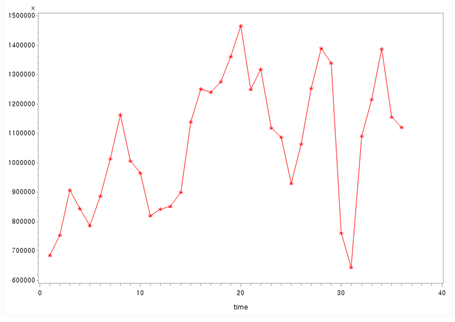
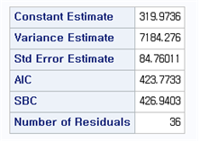
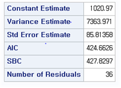
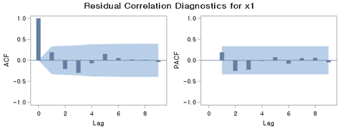
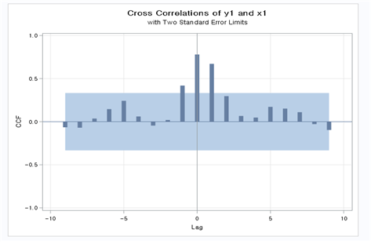
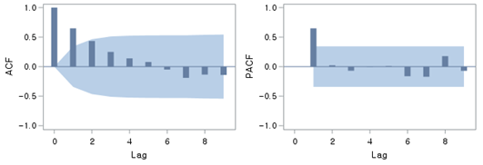
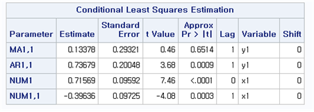
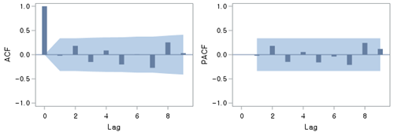

<style>
  body {
    font-family: Georgia, "Times New Roman", Times, serif;
  }

  h1, h2 {
    color: #333;
  }
</style>

<link rel="stylesheet" href="styles.css" type="text/css">
<link rel="stylesheet" href="site_libs/academicons-1.9.1/css/academicons.min.css"/>

<br><br><br>

## **Forecasting Jeju Island Tourism Revenue**


<br>


<br><br><br>


### 1. Introduction
<br>
Time series analysis is a powerful tool for understanding trends, patterns, and relationships in sequential data. <br>
This project focuses on analyzing the relationship between the number of monthly foreign tourists visiting Jeju Island and the corresponding tourism revenue. By leveraging advanced time series modeling techniques, we aim to provide meaningful insights into the dynamics of tourism and its economic impact. 
<br><br><br>

### 2. Goal
<br>
This project aims to predict monthly tourism revenue based on the number of foreign visitors to Jeju Island using Transfer Function Models and ARIMA modeling. By identifying and quantifying the relationship between these variables, the analysis provides actionable insights to support strategic decision-making in the tourism sector.
<br><br><br>

### 3. Figure
<br><br>
<h4>1-1. Plotting</h4>
<br>
The following process was conducted to analyze monthly data of foreign tourists and tourism revenue over time.
<br><br><br><br>
**Raw Time Series Plots**

```r
symbol1 i=join v=star ci=red; 
proc gplot data=travel;
plot x*time=1;
run;

symbol1 i=join v=star ci=blue; 
proc gplot data=travel;
plot y*time=1;
run;
```

<br><br>
<!-- raw_x -->
<p align="center">
  
    <br><br>
</p>
<p align="center" style="font-size: 14px; font-weight: bold;">
  [Fig. Monthly Foreign Tourist Count (x)]
    <br>
</p>
<br><br>

<!-- raw_y -->
<p align="center">
  
    <br><br>
</p>
<p align="center" style="font-size: 14px; font-weight: bold;">
  [Fig. Monthly Tourism Revenue (y)]
    <br>
</p>
<br><br>

From the raw plots, it was determined that variable transformation was necessary to stabilize the variance, although differencing was not required.
<br><br><br>

**Square Root Transformation**

```r
data travel1; 
set travel; 
x1 = sqrt(x); 
y1 = sqrt(y);
```

<br><br>
<!-- squre_x -->
<p align="center">
  
    <br><br>
</p>
<p align="center" style="font-size: 14px; font-weight: bold;">
  [Fig. Transformed Monthly Foreign Tourist Count (x1)]
    <br>
</p>
<br><br>

<!-- squre_y -->
<p align="center">
  
    <br><br>
</p>
<p align="center" style="font-size: 14px; font-weight: bold;">
  [Fig. Transformed Monthly Tourism Revenue (y1)]
    <br>
</p>
<br><br>

The transformed plots indicate that the variance has been stabilized. These transformed data will be used as the basis for further analysis, starting with the identification of ACF and PACF.
<br><br><br><br>

<h4>1-2. Model Identification</h4>
<br><br>
**ACF and PACF Analysis**

```r
symbol1 i=join v=star ci=red; proc gplot data=travel1;
plot x1*time=1;
run;
symbol1 i=join v=star ci=blue; proc gplot data=travel1;
plot y1*time=1 ;
run;

proc arima data=travel1; identify var=x1 ;
run;
proc arima data=travel1; identify var=y1 ;
run;
```

<br><br>
<!-- ACF,PACF_x1 -->
<p align="center">
  
    <br><br>
</p>
<p align="center" style="font-size: 14px; font-weight: bold;">
  [Fig. Trend and Correlation Analysis for (x1)]
    <br>
</p>
<br><br>

<!-- ACF,PACF_y1 -->
<p align="center">
  
    <br><br>
</p>
<p align="center" style="font-size: 14px; font-weight: bold;">
  [Fig. Trend and Correlation Analysis for (y1)]
    <br>
</p>
<br><br>

- The transformed input series (x1) and output series (y1) were analyzed using their respective ACF (Autocorrelation Function) and PACF (Partial Autocorrelation Function) plots. 
<br><br>
- Both the AR (Auto-Regressive) and MA (Moving Average) components show significant spikes at lag 1, suggesting \( p = 1 \) and \( q = 1 \).
<br><br><br><br>

**ARIMA Model Selection** <br>
<br>
Candidate ARIMA models for the input series \( x_1 \):

```r
/*ARIMA((1),1,0)*/
proc arima data=travel1; identify var=x1 ; estimate p=(1) plot;
run;

/*ARIMA(0,1,(1))*/
proc arima data=travel1; identify var=x1 ; estimate q=(1) plot;
run;

/*ARIMA((1),1,(1))*/
proc arima data=travel1; identify var=x1 ;
estimate p=(1) q=(1) plot; run;

```
<br><br><br>
<!-- ARIMA -->
<p align="center">
  
    <br><br>
</p>
<p align="center" style="font-size: 14px; font-weight: bold;">
  [Fig. ARIMA((1), 1, 0) ]
    <br>
</p>
<br><br>

<!-- ARIMA -->
<p align="center">
  
    <br><br>
</p>
<p align="center" style="font-size: 14px; font-weight: bold;">
  [Fig. ARIMA(0, 1, (1)) ]
    <br>
</p>
<br><br>

<!-- AIC -->
<p align="center">
  
    <br><br>
</p>
<p align="center" style="font-size: 14px; font-weight: bold;">
  [Fig. ARIMA(0, 1, (1)) AIC ]
    <br>
</p>
<br><br>

<!-- AIC -->
<p align="center">
  
    <br><br>
</p>
<p align="center" style="font-size: 14px; font-weight: bold;">
  [Fig. ARIMA(0, 1, (1)) AIC ]
    <br>
</p>
<br><br>

Based on the AIC (Akaike Information Criterion), ARIMA((1), 1, 0) was selected as the most appropriate model due to its lower AIC value and significance in parameter estimates.

<br><br><br>

**Portmanteau Test Results** <br>
<br><br>
<!-- Portmanteau -->
<p align="center">
  
    <br><br>
</p>
<p align="center" style="font-size: 14px; font-weight: bold;">
  [Fig. Portmanteau Test Results for the ARIMA((1), 1, 0) Model ]
    <br>
</p>
<br><br>

<!-- Portmanteau -->
<p align="center">
  
    <br><br>
</p>
<p align="center" style="font-size: 14px; font-weight: bold;">
  [Fig. Portmanteau Test Results for the ARIMA(0, 1, (1)) Model ]
    <br>
</p>
<br><br>

<!-- ACF,PACF -->
<p align="center">
  
    <br><br>
</p>
<p align="center" style="font-size: 14px; font-weight: bold;">
  [Fig. ARIMA((1), 1, 0) ACF, PACF ]
    <br>
</p>
<br><br>

Residual diagnostic checks (Portmanteau test) confirmed no significant autocorrelation in the residuals of ARIMA((1), 1, 0), validating the model.

<br><br><br>

**Final Model** <br>
<br><br>
The final model for \( x_1 \):

\[
(1 - 0.6794B)(1 - B)X_t = a_t
\]

where \( B \) is the lag operator.

<br><br><br><br>

<h4>1-3. Prewhitening Process</h4>
<br><br>
The cross-correlation function (CCF) between the input series \( x_1 \) and the output series \( y_1 \) was analyzed.


```r
proc arima data=travel1; identify var=y1 crosscorr=x1; run;
```
<br><br>

<!-- b,r,s -->
<p align="center">
  
    <br><br>
</p>
<p align="center" style="font-size: 14px; font-weight: bold;">
  [Fig. CCF Plot (Cross-Correlation Function Plot) ]
    <br><br>
</p>
<br>
From the CCF plot, the following \( (b, r, s) \) values were estimated:

- \( (b, r, s) = (0, 2, 1) \)
- \( (b, r, s) = (0, 1, 1) \)
- \( (b, r, s) = (0, 0, 1) \)

These values were used as candidates for further model estimation.

<br><br><br><br>

<h4>1-4. Noise Series \( n_t \) Model </h4>
<br><br>
Initially, the transfer function model with \( b = 0 \), \( r = 2 \), and \( s = 1 \) was estimated, and the corresponding ACF and PACF plots for the residuals were generated.

<br><br>
<!-- ACF,PACF -->
<p align="center">
  
    <br><br>
</p>
<p align="center" style="font-size: 14px; font-weight: bold;">
  [Fig. ACF and PACF Plots for Residuals of the Transfer Function Model with \( b = 0 \), \( r = 2 \), and \( s = 1 \) ]
    <br><br>
</p>

- The residuals were not white noise, indicating that further adjustments to the model were necessary.
- An ARMA model with \( p = 1 \) and \( q = 1 \) was applied to refine the noise series model.

<br><br><br>

```r
proc arima data=travel1;
identify var=y1 crosscorr=x1;
estimate p=1 q=1 input=(0$(1)/(0)x1) noconstant plot; run;
```
<br><br>
<!-- stimated Parameter -->
<p align="center">
  
    <br><br>
</p>
<p align="center" style="font-size: 14px; font-weight: bold;">
  [Fig. stimated Parameters for the Final Model (b = 0, r = 0, s = 1) ]
    <br>
</p>
<br>

- This table shows the estimated parameters for the final transfer function model with \( b = 0 \), \( r = 0 \), and \( s = 1 \).  
- All parameters are statistically significant, confirming the suitability of this model.

<br><br><br>
<!-- Portmanteau Test Results for the Final Model -->
<p align="center">
  
    <br><br>
</p>
<p align="center" style="font-size: 14px; font-weight: bold;">
  [Fig. Portmanteau Test Results for the Final Model ]
    <br>
</p>
<br>

- The results indicate that the residuals of the final model exhibit no significant autocorrelation, as all p-values are large.
- This confirms that the residuals behave as white noise, validating the adequacy of the final model.

<br><br><br>
<!-- ACF and PACF Plots for the Residuals of the Final Model -->
<p align="center">
  
    <br><br>
</p>
<p align="center" style="font-size: 14px; font-weight: bold;">
  [Fig. ACF and PACF Plots for the Residuals of the Final Model ]
    <br>
</p>
<br>

- These plots visually confirm that the residuals of the final model show no significant autocorrelation.
- The results further support the conclusion that the model captures the underlying structure of the data effectively.

<br><br>
The results of the Portmanteau test indicate that the p-values are large, confirming that there is no autocorrelation in the residuals.  
Additionally, the estimated parameters of the model are all statistically significant.  
The ACF and PACF plots of the residuals further demonstrate that \( n_t \) behaves as white noise.  
Therefore, the **ARIMA(0, 0, 1)** model is selected as the final model.

<br><br>


The final model is as follows:

\[
(1 - B)Y_t = \frac{0.71569}{1 - 0.39636B}BX_t + a_t, \quad \hat{a}_t = 380.9856
\]

<br><br>
 **Model Summary:** <br>
 <br>
 
- Variance Estimate: 2807.963 <br>
- Standard Error Estimate: 52.99021 <br>
- AIC: 380.9856 <br>
- SBC: 387.207 <br>
- Number of Residuals: 35

<br><br><br>

 **Model Components:** <br>
 <br>
 
- Autoregressive Factors:
  \[
  1 - 0.73679B^{1}
  \]
- Moving Average Factors:
  \[
  1 - 0.13378B^{1}
  \]
- Input Variable: \( x_1 \) <br><br>
- Numerator Factors:
  \[
  0.71569 + 0.39636B^{1}
  \]


<br><br><br><br>

### 3. Methodology & Summary
<br><br>
**Data Preprocessing**: 

- Monthly data for foreign tourist counts (\(x\)) and tourism revenue (\(y\)) were transformed using a square root transformation to stabilize variance. 
- Cross-correlation analysis (CCF) was used to identify the lag structure between \(x_1\) (transformed tourist counts) and \(y_1\) (transformed revenue).
<br><br>

**Model Development**:

- Multiple transfer function models were estimated for combinations of \((b, r, s)\), where the final model with \(b = 0\), \(r = 0\), and \(s = 1\) was selected based on the Portmanteau test and residual diagnostics.
- The final model coefficients were statistically significant, with residuals behaving as white noise.
<br><br>

**Final Model**:

- The chosen ARIMA model for the input series \(x_1\) and its impact on the output series \(y_1\) is represented as:
      \[
      (1 - B)Y_t = \frac{0.71569}{1 - 0.39636B}BX_t + a_t, \quad \hat{a}_t = 380.9856
      \]
- The model achieved high accuracy with a low variance estimate of 2807.963 and an AIC value of 380.9856, demonstrating its predictive capability.
<br><br>

**Significance of Results**:

- The model effectively captures the relationship between foreign tourist counts and tourism revenue, making it suitable for short-term forecasting.
- These findings can guide tourism stakeholders in optimizing marketing strategies and resource allocation.

<br><br>

### 4. Code

Please click [HERE](https://github.com/jiyechoi-data/tourism-revenue-forecasting/blob/main/script/tourism_revenue_analysis.sas) for the code.

<br><br>

### 5. Conclusion
<br><br>
This project successfully analyzed the relationship between monthly foreign tourist counts and tourism revenue using transfer function models and ARIMA modeling. <br>
<br>
The key findings include:
<br><br>
**Variance Stabilization**: The square root transformation proved effective in stabilizing variance, improving model fit. <br>

**Optimal Model Selection**: The final transfer function model (\(b=0\), \(r=0\), \(s=1\)) accurately captured the dynamic relationship, supported by statistically significant coefficients and white noise residuals. <br>

**Practical Implications**: The model provides actionable insights for forecasting future revenue trends based on expected tourist numbers.


