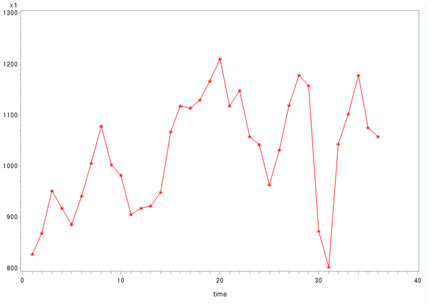
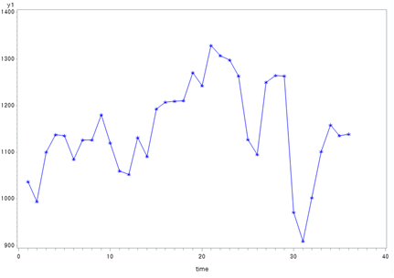
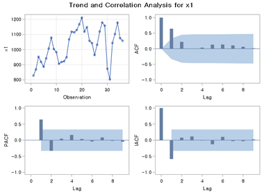

<style>
  body {
    font-family: Georgia, "Times New Roman", Times, serif;
  }

  h1, h2 {
    color: #333;
  }
</style>

<link rel="stylesheet" href="styles.css" type="text/css">
<link rel="stylesheet" href="site_libs/academicons-1.9.1/css/academicons.min.css"/>

<br><br><br>

## **Forecasting Jeju Island Tourism Revenue**


<br>


<br><br><br>


### 1. Introduction
<br>
Time series analysis is a powerful tool for understanding trends, patterns, and relationships in sequential data. <br>
This project focuses on analyzing the relationship between the number of monthly foreign tourists visiting Jeju Island and the corresponding tourism revenue. By leveraging advanced time series modeling techniques, we aim to provide meaningful insights into the dynamics of tourism and its economic impact. 
<br><br><br>

### 2. Goal
<br>
This project aims to predict monthly tourism revenue based on the number of foreign visitors to Jeju Island using Transfer Function Models and ARIMA modeling. By identifying and quantifying the relationship between these variables, the analysis provides actionable insights to support strategic decision-making in the tourism sector.
<br><br><br>

### 3. Figure
<br><br>
<h4>1-1. Plotting</h4>
<br>
The following process was conducted to analyze monthly data of foreign tourists and tourism revenue over time.
<br><br><br><br>
**Raw Time Series Plots**

```r
symbol1 i=join v=star ci=red; 
proc gplot data=travel;
plot x*time=1;
run;

symbol1 i=join v=star ci=blue; 
proc gplot data=travel;
plot y*time=1;
run;
```

<br><br>
<!-- raw_x -->
<p align="center">
  
    <br><br>
</p>
<p align="center" style="font-size: 14px; font-weight: bold;">
  [Fig. Monthly Foreign Tourist Count (x)]
    <br>
</p>
<br><br>

<!-- raw_y -->
<p align="center">
  
    <br><br>
</p>
<p align="center" style="font-size: 14px; font-weight: bold;">
  [Fig. Monthly Tourism Revenue (y)]
    <br>
</p>
<br><br>

From the raw plots, it was determined that variable transformation was necessary to stabilize the variance, although differencing was not required.
<br><br><br>

**Square Root Transformation**

```r
data travel1; 
set travel; 
x1 = sqrt(x); 
y1 = sqrt(y);
```

<br><br>
<!-- squre_x -->
<p align="center">
  
    <br><br>
</p>
<p align="center" style="font-size: 14px; font-weight: bold;">
  [Fig. Transformed Monthly Foreign Tourist Count (x1)]
    <br>
</p>
<br><br>

<!-- squre_y -->
<p align="center">
  
    <br><br>
</p>
<p align="center" style="font-size: 14px; font-weight: bold;">
  [Fig. Transformed Monthly Tourism Revenue (y1)]
    <br>
</p>
<br><br>

The transformed plots indicate that the variance has been stabilized. These transformed data will be used as the basis for further analysis, starting with the identification of ACF and PACF.
<br><br><br><br>

<h4>1-2. Model Identification and Parameter Estimation</h4>
<br><br>
**ACF and PACF Analysis**

```r
symbol1 i=join v=star ci=red; proc gplot data=travel1;
plot x1*time=1;
run;
symbol1 i=join v=star ci=blue; proc gplot data=travel1;
plot y1*time=1 ;
run;

proc arima data=travel1; identify var=x1 ;
run;
proc arima data=travel1; identify var=y1 ;
run;
```

<br><br>
<!-- ACF,PACF_x1 -->
<p align="center">
  
    <br><br>
</p>
<p align="center" style="font-size: 14px; font-weight: bold;">
  [Fig. Trend and Correlation Analysis for (x1)]
    <br>
</p>
<br><br>

<!-- ACF,PACF_y1 -->
<p align="center">
  
    <br><br>
</p>
<p align="center" style="font-size: 14px; font-weight: bold;">
  [Fig. Trend and Correlation Analysis for (y1)]
    <br>
</p>
<br><br>

- The transformed input series (x1) and output series (y1) were analyzed using their respective ACF (Autocorrelation Function) and PACF (Partial Autocorrelation Function) plots. 
<br><br>
- Both the AR (Auto-Regressive) and MA (Moving Average) components show significant spikes at lag 1, suggesting \( p = 1 \) and \( q = 1 \).

<br><br><br><br>


### 3. Methodology & Summary

  + LASSO regressions showed the best performance with a cross validation RMSE-score of 0.1121. Although there is a lot of multicollinearity among the variables, LASSO regression include feature selection; it does not select a substantial number of the available variables in its model, as it is supposed to do.
  + The XGBoost model also performs very well with a cross validation RMSE of 0.1162.
  + As those two algorithms are very different, averaging predictions is likely to improve the predictions. As the Lasso cross validated RMSE is better than XGBoost's CV score, I decided to weight the Lasso results double.

<br>

### 4. Code

Please click [HERE](https://www.kaggle.com/erikbruin/house-prices-lasso-xgboost-and-a-detailed-eda/report) for the analysis report and code.

<br>


