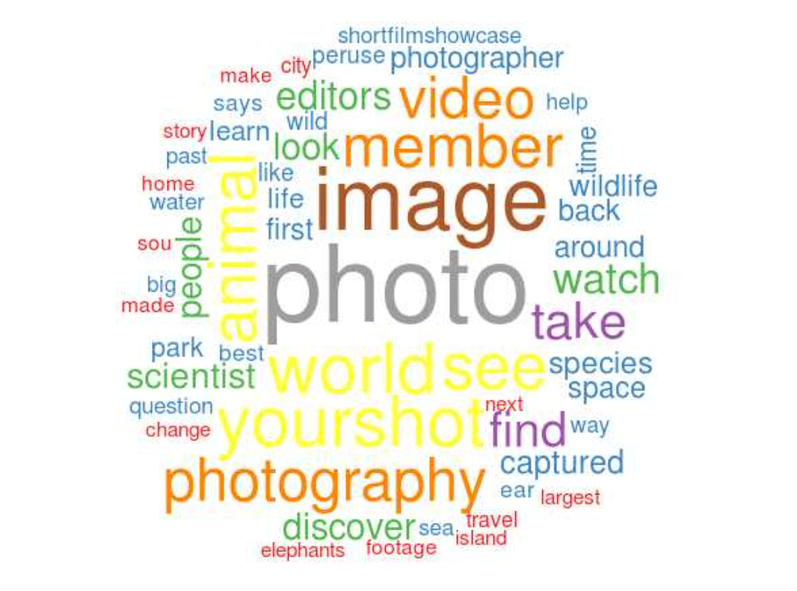
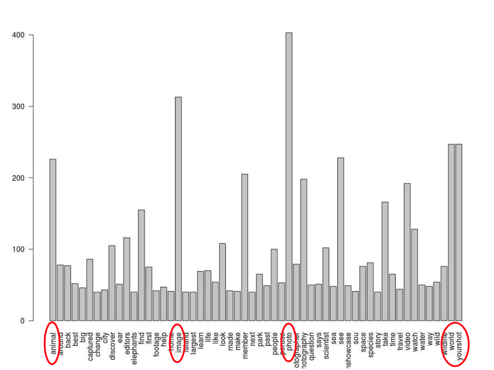
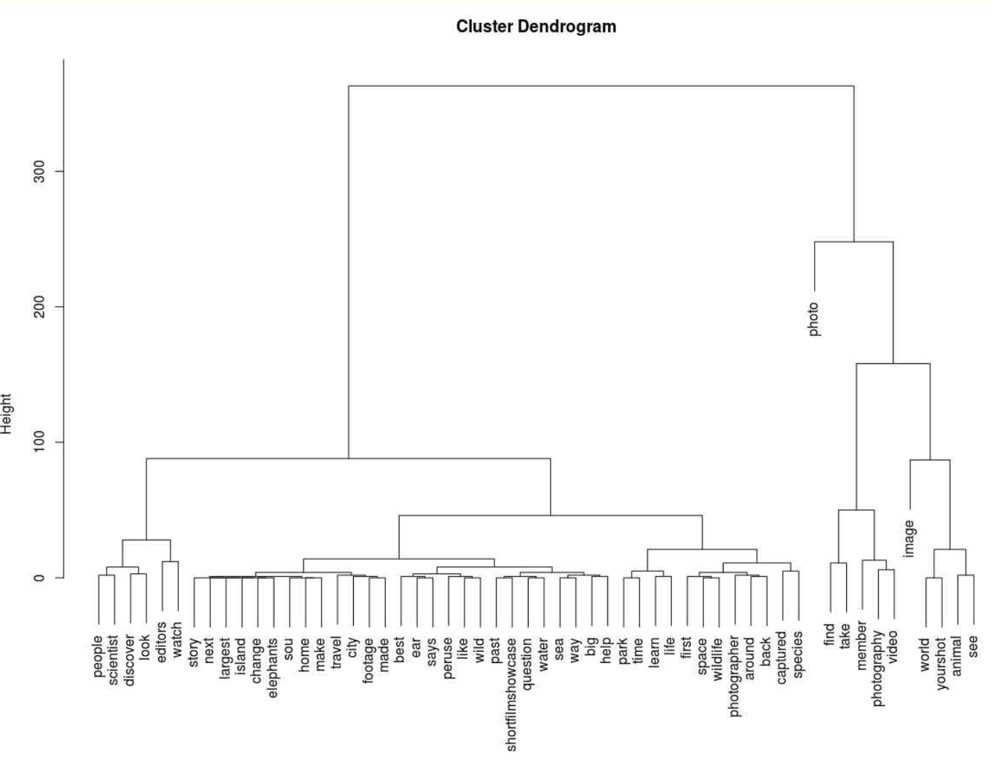
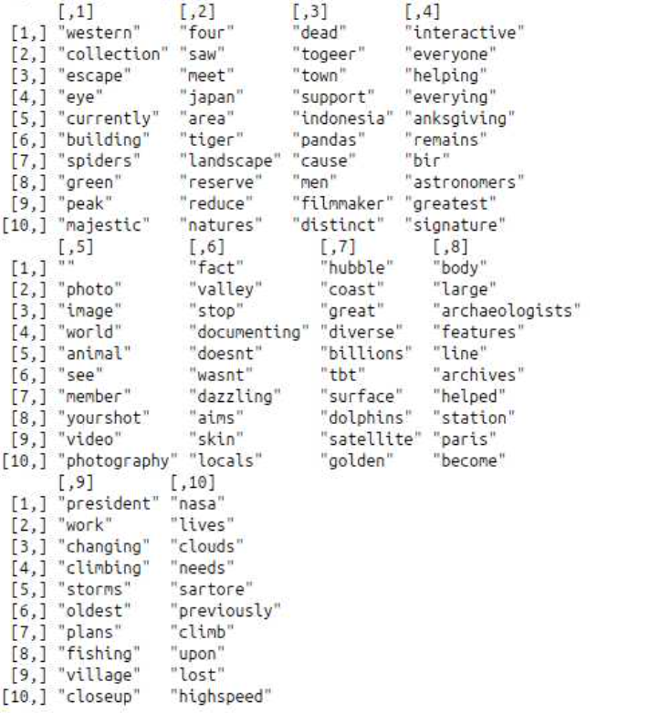

<style>
  body {
    font-family: Georgia, "Times New Roman", Times, serif;
  }

  h1, h2 {
    color: #333;
  }
</style>

<link rel="stylesheet" href="styles.css" type="text/css">
<link rel="stylesheet" href="site_libs/academicons-1.9.1/css/academicons.min.css"/>

<br><br><br>

## **Facebook "National Geographic" Engagement Analysis**


<br>


<br><br><br>

### 1. Goal
To analyze the engagement patterns of the "National Geographic" Facebook page by applying text mining techniques on the posts. The goal is to identify key themes, frequent topics, and clusters of related words, providing insights into the page’s content and audience interaction.

<br><br>

### 2. Figure

<br>

```r
# Load required libraries
library(tm)
library(Rfacebook)
library(wordcloud)
library(SnowballC)
library(lda)

# Step 1: Facebook API Data Collection
token <- "YOUR_FACEBOOK_API_TOKEN"
N_timeline <- getPage(page = "NatGeo", token, n = 2000)
test <- N_timeline$message
test <- test[!is.na(test)]

# Step 2: Text Cleaning
myCorpus <- Corpus(VectorSource(test))
myCorpus <- tm_map(myCorpus, content_transformer(tolower))
myCorpus <- tm_map(myCorpus, removePunctuation)
myCorpus <- tm_map(myCorpus, removeNumbers)
myCorpus <- tm_map(myCorpus, removeWords, stopwords("english"))

# Step 3: Word Cloud
TDM <- TermDocumentMatrix(myCorpus, control=list(wordLengths=c(2, Inf)))
m <- as.matrix(TDM)
wordFreq <- sort(rowSums(m), decreasing=TRUE)
wordcloud(words=names(wordFreq), freq=wordFreq, scale=c(5, 0.5), min.freq=40)

# Save Word Cloud
png("images/wordcloud_facebook.png", width = 800, height = 800)
wordcloud(words=names(wordFreq), freq=wordFreq, scale=c(5, 0.5), min.freq=40)
dev.off()
```

<br><br>

<!-- Word Cloud -->
<p align="center">
  
    <br><br>
</p>
<p align="center" style="font-size: 14px; font-weight: bold;">
  [Fig. Word Cloud of National Geographic Facebook Page]
    <br>
</p>

<br><br><br>

```r
# Step 4: Bar Plot
barplot(subset(wordFreq, wordFreq>=40), las=2)
```

<br><br><br>

<!-- Bar Chart -->
<p align="center">
  
    <br><br>
</p>
<p align="center" style="font-size: 14px; font-weight: bold;">
  [Fig. Bar Chart of Word Frequencies]
    <br>
</p>

<br><br><br>

```r
# Step 5: Clustering (Dendrogram)
plot(hclust(dist(wordFreq)))

# Save Dendrogram
png("images/dendrogram_facebook.png", width = 800, height = 600)
plot(hclust(dist(wordFreq)))
dev.off()
```
<br><br><br>

<!-- Dendrogram -->
<p align="center">
  
    <br><br>
</p>
<p align="center" style="font-size: 14px; font-weight: bold;">
  [Fig. Dendrogram for Text Clustering]
    <br>
</p>

<br><br><br>

```r
# Step 6: Topic Modeling (LDA)
corpusLDA <- lexicalize(myCorpus)
ldaModel <- lda.collapsed.gibbs.sampler(corpusLDA$documents, K=10, vocab=corpusLDA$vocab, burnin=9999, num.iterations=1000, alpha=1, eta=0.1)
top.words <- top.topic.words(ldaModel$topics, 10, by.score=TRUE)
```
<br><br><br>

<!-- Topic Modeling -->
<p align="center">
  
  <br><br>
</p>
<p align="center" style="font-size: 14px; font-weight: bold;">
  [Fig. Topic Modeling Output]
  <br>
</p>

<br><br>


### 3. Method & Summary:
<div style="line-height: 2;">
<p style="margin-bottom: 20px;">
  <p>1. Data Collection:</p>
  <ul>
    <li>Used the Facebook API to extract up to 2000 posts from the National Geographic page.</li>
    <li>Data cleaning included converting text to lowercase, removing punctuation, numbers, and stopwords, and applying specific filters for unnecessary words.</li>
  </ul>

<p style="margin-bottom: 20px;">
  <p>2. Text Mining Techniques:</p>
  <ul>
    <li><strong>Word Cloud</strong>: A word cloud was generated using term-document matrices to visualize the most common words.</li>
    <li><strong>Bar Plot</strong>: A bar chart was created to display the frequency of words that appeared more than 40 times.</li>
    <li><strong>Clustering</strong>: Hierarchical clustering was applied to group similar words, visualized through a dendrogram.</li>
    <li><strong>Topic Modeling</strong>: Latent Dirichlet Allocation (LDA) was used to extract 10 topics from the posts.</li>
  </ul>

<p style="margin-bottom: 20px;">
  <p>3. Key Findings:</p>
<ul>
    <li><strong>Most frequent words</strong> include “photo,” “image,” “world,” and “animal,” reflecting the page’s focus on photography and wildlife.</li>
    <li><strong>Clustering results</strong> show related words grouped into distinct themes, and the LDA model highlights topics such as photography, wildlife, and environmental awareness.</li>
    <li><strong>Engagement Patterns</strong>: Posts related to wildlife conservation received the most audience engagement.</li>
</ul>
</div>

<br><br>

### 4. Code

The full code for this project, including data collection, text cleaning, word cloud generation, clustering, and topic modeling, is available on [GitHub](https://github.com/jiyechoi-data/natgeo-facebook-engagement/blob/main/scripts/Facebook_analysis.R).

Key tools and libraries used in this project:

- **R** for text mining and analysis.
- **Rfacebook** for accessing the Facebook API.
- **tm**, **SnowballC**, **wordcloud** for text preprocessing and visualization.
- **lda** for topic modeling.
<br><br><br>

### 5. Conclusion

In this project, we successfully analyzed the engagement patterns of the "National Geographic" Facebook page through various text mining techniques. Key findings indicate a strong focus on wildlife photography and conservation. 
Future improvements could involve sentiment analysis to determine audience reactions and further investigation into time-based engagement trends.


