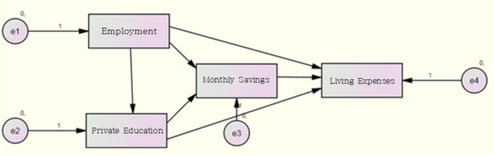
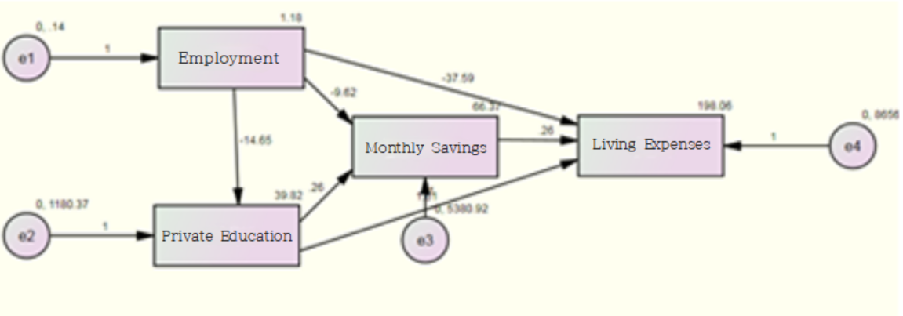

<link rel="stylesheet" href="styles.css" type="text/css">
<link rel="stylesheet" href="site_libs/academicons-1.9.1/css/academicons.min.css"/>

   

## **Analyzing Monthly Living Expenses**

 

   

### 1. Introduction
 
Understanding the relationship between living expenses and savings is crucial in today's economy for effective financial planning. This project investigates how various factors such as employment status and educational expenses for children influence monthly living expenses. Leveraging latent growth curve modeling (LGCM) and path analysis, the study uncovers patterns and relationships to provide insights into economic behaviors.
   

### 2. Goal
 
The primary goal of this study is to analyze how monthly living expenses evolve over time and to determine whether factors like employment status, educational expenses for children, and savings significantly impact these changes. Additionally, the study aims to evaluate how missing data treatment methods, such as regression imputation and full information maximum likelihood (FIML), affect the analysis results.

  

### 3. Data and Variables
 
This project uses data from the Korean Longitudinal Survey of Women & Families (KLoWF), encompassing responses from 9,068 households over three years (2011–2013). The panel dataset allows for tracking changes over time and assessing individual-level variations in living expenses.  
 
The dataset includes information on various financial and demographic factors, with a focus on the following variables:
 

- **Monthly Living Expenses**: Average monthly household expenses in 10,000 Korean Won (KRW).  
- **Savings**: Total monthly savings, including deposits, savings-type insurance, and pensions, expressed in 10,000 KRW.  
- **Employment Status**: A binary variable indicating whether the household head is employed (Yes/No).  
- **Educational Expenses**: Monthly spending on children’s education, including childcare and extracurricular activities, expressed in 10,000 KRW.

  

### 4. Exploratory Data Analysis
 

Below are the descriptive statistics and frequency analysis results from SPSS:
   

| Variable               |  Year  |  Mean (KRW)  | Standard Deviation (KRW)|
|------------------------|--------|--------------|-------------------------|
| Monthly Living Expenses|  2011  |   178.75     |          50.30          |
|                        |  2012  |   191.31     |          55.12          |
|                        |  2013  |   205.15     |          60.45          |
|                        |        |              |                         |
 

- Average monthly living expenses show a clear upward trend over the three years.  
- The increasing standard deviation highlights growing variability in expenses, indicating widening differences in household spending patterns. This could reflect changes in income distribution or spending habits among households.
    

| Variable              | Category             | Frequency (%) |
|-----------------------|----------------------|---------------|
| Employment Status     | Employed             | 82.4          |
|                       | Unemployed           | 17.6          |
|                       |                      |               |
 

- A significant majority of households (82.4%) have an employed head of household, suggesting financial stability through employment.
- A smaller portion (17.6%) of households have an unemployed head of household, indicating potential financial challenges for these households.

    

| Savings Category   | Frequency | Percentage (%) | Cumulative Percentage (%) |
|--------------------|----------|-----------------|---------------------------|
| 1-100              | 4285     | 47.3            | 47.3                      |
| 101-200            | 4192     | 46.2            | 93.5                      |
| 201-300            | 455      | 5.0             | 98.5                      |
| 301-400            | 89       | 1.0             | 99.5                      |
| 401-1500           | 28       | 0.3             | 99.8                      |
| Total              | 9068     | 100.0           | 100.0                     |
 

- The largest percentage of households (47.3%) have savings in the 1-100 (10,000 KRW) range, followed by 46.2% in the 101-200 KRW range.
- Very few households save above 300 (10,000 KRW), with only 1% saving in the 301-400 (10,000 KRW) range.
- The Cumulative Percentage column shows that over 93% of households have savings of 200 (10,000 KRW) or less, suggesting a concentration in lower savings categories.

    

| Educational Expenses Category | Frequency (%) |
|-------------------------------|---------------|
| 1-50 (10,000 KRW)              | 85.6          |
| 51-100 (10,000 KRW)            | 12.0          |
| 101-150 (10,000 KRW)           | 1.8           |
| 151-200 (10,000 KRW)           | 0.5           |
| 201+ (10,000 KRW)              | 0.2           |
| Total                          | 100.0         |

 

- The majority of households (85.6%) spend between 1-50 (10,000 KRW) on educational expenses.
- 12.0% of households spend between 51-100 (10,000 KRW), while only 0.2% spend more than 2M KRW.
- The cumulative percentage shows that 99.5% of households have educational expenses below 2M KRW.

  

To investigate how monthly living expenses change over time, we will address missing data using two imputation methods and then apply **Latent Growth Curve Modeling (LGCM)** to analyze the data.

   

### 5. Method 1: Regression Imputation

  
<h4> 1-1. Path Analysis </h4>
 

Path analysis will be conducted to examine the causal relationships between Employment Status, Educational Expenses, Average Monthly Savings, and Living Expenses, specifically to understand how Employment Status and Educational Expenses influence Living Expenses.

    

<!-- path analysis1 -->

  
      

  [Fig. Path Diagram of the Research Model]
     

  

This research model assumes that Employment Status influences Private Education Expenses, Monthly Savings, and Living Expenses. It also assumes that Private Education Expenses impact Monthly Savings and Living Expenses, and that Monthly Savings influence Living Expenses.

  
Model Fit Evaluation (Default Model)
 

- Number of distinct sample moments: 14
- Number of distinct parameters to be estimated: 14
- Degrees of freedom: 0 (calculated as 14 - 14)

 

Results:

- Chi-Square: 0.000
- Degrees of Freedom: 0
- Minimum Achieved
- Probability level cannot be computed

  

The results show \( \chi^2 = 0 \) and \( df = 0 \). When \( \chi^2 = 0 \), it indicates a perfect fit between the research model and the data, meaning there is no difference between the observed values and the predicted values. The \( df = 0 \) implies that the number of parameters to be estimated is equal to the number of data points, which typically occurs in highly constrained models.

This type of model is considered **over-identified** and is the most constrained form of the model, providing the highest degree of fit but lacking flexibility. Because of this, such models are overly simplistic and cannot capture the complexity of the relationships between variables. Therefore, no meaningful conclusions can be drawn from this model due to its lack of complexity and capacity to represent real-world data.

    

<!-- path analysis2 -->

  
      

  [Fig. Graphical Representation of Model Estimates]
     

  

| Path                              | Estimate | S.E.   | C.R.    | P      | Label |
|-----------------------------------|----------|--------|---------|--------|-------|
| Private Education ← Employment    | -14.655  | 0.948  | -15.464 | ***    |       |
| Savings ← Employment              | -9.622   | 2.060  | -4.694  | ***    |       |
| Savings ← Private Education       | 0.265    | 0.013  | 19.961  | ***    |       |
| Living Expenses 2013 ← Savings    | -37.592  | 2.603  | -14.446 | ***    |       |
| Living Expenses 2013 ← Private Education | 1.610   | 0.029  | 56.194  | ***    |       |

  

Summary
  

- Path Coefficient: -14.655
- p-value: < 0.01
- Significance Level: \( \alpha = 0.05 \)
- Interpretation: Employment status significantly and negatively affects private education expenditures.

   
Path Coefficient Interpretation
  

- The **direct effect** can be evaluated based on the magnitude and significance of the path coefficient. 

- The path coefficient for **[Employment → Private Education]** is -14.655, and the p-value is smaller than 0.01, indicating significance at the \( \alpha = 0.05 \) level.
- This result shows that **employment status** has a significant direct effect on **private education**, with a **negative direction** of influence.

    
<h4> 1-2. Effects Analysis </h4>
 

 

**Total Effects**
  
 
| Path                        | Employment | Private Education | Savings |
|-----------------------------|------------|-------------------|---------|
| Private Education           | -14.655    | 0.000             | 0.000   |
| Savings                     | -13.497    | 0.264             | 0.000   |
| Living Expenses (2013)      | -64.762    | 1.660             | 0.265   |

  

**Direct Effects**
  
 
| Path                        | Employment | Private Education | Savings |
|-----------------------------|------------|-------------------|---------|
| Private Education           | -14.655    | 0.000             | 0.000   |
| Savings                     | -9.622     | 0.264             | 0.000   |
| Living Expenses (2013)      | -37.592    | 1.610             | 0.265   |

  

**Indirect Effects**
 

| Path                        | Employment | Private Education | Savings |
|-----------------------------|------------|-------------------|---------|
| Private Education           | 0.000      | 0.000             | 0.000   |
| Savings                     | -3.876     | 0.000             | 0.000   |
| Living Expenses (2013)      | -27.171    | 0.070             | 0.000   |

   

**Path: Employment → Savings**
  

- Total Effect: -13.497
- Direct Effect: -9.622
- Indirect Effect: -3.876

  
The relationship can be broken down as follows:
\[
\text{Total Effect} (-13.497) = \text{Direct Effect} (-9.622) + \text{Indirect Effect} (-3.876)
\]

 
The Indirect Effect of -3.876 is calculated as:
\[
\text{Indirect Effect} (-3.876) = \text{Path Coefficient} (\text{Employment → Private Education}) (-14.655) \times \text{Path Coefficient} (\text{Private Education → Savings}) (0.264)
\]
  

---

  
**Path: Employment → Living Expenses**

 

- Total Effect: -64.762
- Direct Effect: -37.592
- Indirect Effect: -27.171

 
The relationship can be broken down as follows:
\[
\text{Total Effect} (-64.762) = \text{Direct Effect} (-37.592) + \text{Indirect Effect} (-27.171)
\]

 
The Indirect Effect of -27.171 is further decomposed into the following pathways: 

1. Employment → Savings → Living Expenses  
2. Employment → Private Education → Savings → Living Expenses  
3. Employment → Private Education → Living Expenses
  

---

  
Summary
  

- The **Indirect Effect** highlights the mediating roles of **Private Education** and **Savings** in the impact of **Employment** on **Living Expenses**.

- The decomposition provides insights into the complex pathways that influence the dependent variable.

    

**Direct Effect Significance**

 
The significance of the direct effects is as follows:
 

| Path                          | Estimate  | S.E.  | C.R.   | p-value  | Significance |
|-------------------------------|-----------|-------|--------|----------|--------------|
| Private Education ← Employment| -14.655   | 0.948 | -15.464| ***      | Significant  |
| Savings ← Employment          | -9.622    | 2.060 | -4.694 | ***      | Significant  |
| Savings ← Private Education   | 0.265     | 0.013 | 19.961 | ***      | Significant  |
| Living Expenses ← Savings     | -37.592   | 2.603 | -14.446| ***      | Significant  |
| Living Expenses ← Private Education | 1.610| 0.029 | 56.194 | ***      | Significant  |

 

Interpretation
  

- The path **Private Education ← Employment** has a significant direct effect with a negative coefficient of **-14.655**, indicating that Employment negatively influences Private Education.

- The path **Savings ← Employment** also shows a significant negative direct effect of **-9.622**.

- All direct effects have p-values less than **0.001 (***), indicating high statistical significance.

    

**Indirect Effect Significance**

 

- The \( p \)-values for all indirect effects were \( p = 0.010 \), which is statistically significant at \( \alpha = 0.05 \).
- This confirms that the indirect effects in the model are significant and meaningful.

