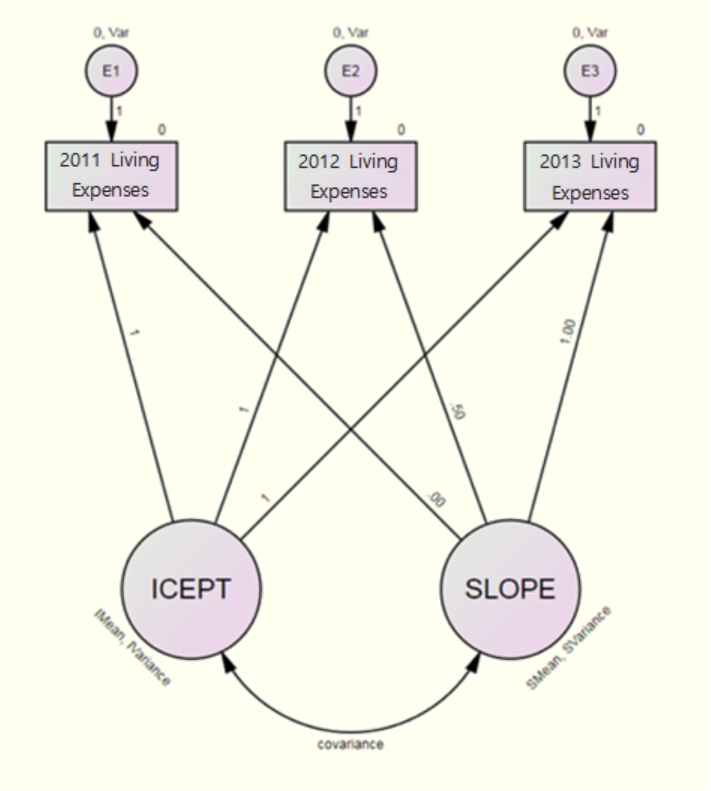

<link rel="stylesheet" href="styles.css" type="text/css">
<link rel="stylesheet" href="site_libs/academicons-1.9.1/css/academicons.min.css"/>

   

## **Analyzing Monthly Living Expenses**

 

   

### 1. Introduction
 
Understanding the relationship between living expenses and savings is crucial for effective financial planning.   This study aims to analyze how monthly living expenses evolve over time and to determine whether factors such as employment status, educational expenses for children, and savings significantly impact these changes.   Using SPSS for data preprocessing and AMOS for latent growth curve modeling (LGCM) and path analysis, the study also evaluates the effects of missing data treatment methods, including regression imputation and full information maximum likelihood (FIML), to uncover meaningful patterns and relationships in economic behaviors.
    

### 2. Analysis

  
<h4> 1-1. Exploratory Data Analysis </h4>
 
This study utilizes data from the Korean Longitudinal Survey of Women and Families (KLoWF), focusing on the following key variables (measured in units of 10,000 Korean Won, KRW):

 

- **Monthly Living Expenses**: Household expenses reported on a monthly basis. 
- **Savings**: Total monthly savings, including deposits, insurance, and pensions. 
- **Employment Status**: Binary variable indicating whether the household head is employed.  
- **Educational Expenses**: Monthly spending on children’s education, including extracurricular activities.

 

This study analyzed the monthly living expenses, savings, and educational expenses of households to uncover significant patterns and trends. 

   
Below is a summary of the key findings and descriptive statistics:
  

Descriptive Statistics for Monthly Living Expenses
  

| Year   | Mean (10,000 KRW) | Standard Deviation (10,000 KRW) |
|--------|--------------------|---------------------------------|
| 2011   | 178.75            | 50.30                          |
| 2012   | 191.31            | 55.12                          |
| 2013   | 205.15            | 60.45                          |
 

- Monthly living expenses increased consistently from 178.75 in 2011 to 205.15 in 2013, showing a clear upward trend.
 - The increasing standard deviation reflects growing variability, suggesting widening differences in spending patterns among households.
  

---

  

Employment Status
  

| Employment Status | Frequency (%) |
|-------------------|---------------|
| Employed          | 82.4          |
| Unemployed        | 17.6          |

 

- A significant majority of households (82.4%) had an employed head of household, suggesting financial stability.
- A smaller proportion (17.6%) had an unemployed head of household, indicating potential financial challenges.

  

---

  

Savings
  

| Savings Category (10,000 KRW) | Frequency | Percentage (%) | Cumulative Percentage (%) |
|-------------------------------|-----------|-----------------|---------------------------|
| 1–100                         | 4,285     | 47.3            | 47.3                      |
| 101–200                       | 4,192     | 46.2            | 93.5                      |
| 201–300                       | 455       | 5.0             | 98.5                      |
| 301–400                       | 89        | 1.0             | 99.5                      |
| 401–1,500                     | 28        | 0.3             | 99.8                      |
| Total                     | 9,068     | 100.0       | 100.0                 |
 

- Nearly 93.5% of households saved less than 2 million KRW per month, highlighting financial constraints for most households.
- Very few households (1.3%) saved more than 3 million KRW, indicating a skewed distribution toward lower savings.

  

---

  

Educational Expenses
  

| Educational Expenses Category (10,000 KRW) | Frequency (%) |
|--------------------------------------------|---------------|
| 1–50                                       | 85.6          |
| 51–100                                     | 12.0          |
| 101–150                                    | 1.8           |
| 151–200                                    | 0.5           |
| 201+                                       | 0.2           |
| Total                                  | 100.0    |

 

- The majority of households (85.6%) spent between 1–50 (10,000 KRW) on educational expenses, indicating relatively low expenditure in this category.
- Only 0.2% of households reported spending more than 2 million KRW on education, highlighting its rarity.

    

To investigate how monthly living expenses change over time, we will address missing data using two imputation methods: **Regression Imputation** and **Full Information Maximum Likelihood (FIML)**.   Following this, we will apply Latent Growth Curve Modeling (LGCM) to analyze the data.

    

<h4> 1-2. Path Analysis </h4>
 
This study examines the causal relationships between Employment Status, Educational Expenses, Savings, and Living Expenses using path analysis. Missing data were handled using **Regression Imputation**.

    

<!-- path analysis1 -->

  
      

  [Fig. Path Diagram of the Research Model]
     

  

Model Fit Evaluation (Default Model)
 

| Metric                 | Value |
|------------------------|-------|
| Chi-Square (\( \chi^2 \)) | 0.000 |
| Degrees of Freedom (df)| 0     |

  

\( \chi^2 = 0 \) and \( df = 0 \), indicating a perfect model fit, but this implies an **over-identified model** that lacks flexibility. Such models, while mathematically sound, may oversimplify complex relationships and limit meaningful conclusions.

     

<!-- path analysis2 -->

  
      

  [Fig. Graphical Representation of Model Estimates]
     

  

Key Path Coefficients
  

| Path                              | Estimate | p-value  | Interpretation                                   |
|-----------------------------------|----------|----------|-------------------------------------------------|
| Private Education ← Employment    | -14.655  | ***      | Employment significantly decreases education expenses. |
| Savings ← Employment              | -9.622   | ***      | Employment negatively impacts savings.          |
| Savings ← Private Education       | 0.265    | ***      | Private education increases savings slightly.   |
| Living Expenses ← Savings         | -37.592  | ***      | Savings significantly reduces living expenses.  |
| Living Expenses ← Private Education | 1.610   | ***      | Education expenses increase living expenses slightly. |

  

---

  
Total, Direct, and Indirect Effects
  

| Effect Type     | Path                        | Total    | Direct   | Indirect | Interpretation                                   |
|-----------------|-----------------------------|----------|----------|----------|-------------------------------------------------|
| **Total Effect**| Employment → Savings        | -13.497  | -9.622   | -3.876   | Employment indirectly impacts savings via education. |
| **Total Effect**| Employment → Living Expenses| -64.762  | -37.592  | -27.171  | Employment influences living expenses through multiple pathways. |

   

Breakdown of Indirect Effects:
  

1. Employment → Private Education → Savings  
   \[
   -14.655 \times 0.265 = -3.876
   \]
   
 

2. Employment → Savings → Living Expenses  
   \[
   -9.622 \times -37.592 = -27.171
   \]
   

   

Statistical Significance of Effects
  

| Path                              | Estimate | S.E.  | C.R.    | p-value  | Significance |
|-----------------------------------|----------|-------|---------|----------|--------------|
| Private Education ← Employment    | -14.655  | 0.948 | -15.464 | ***      | Significant  |
| Savings ← Employment              | -9.622   | 2.060 | -4.694  | ***      | Significant  |
| Living Expenses ← Savings         | -37.592  | 2.603 | -14.446 | ***      | Significant  |
| Living Expenses ← Private Education| 1.610   | 0.029 | 56.194  | ***      | Significant  |

 

- All paths show statistically significant effects at \( p < 0.001 \).

   

Insights from Path Analysis :
  

- Employment Status negatively impacts both Private Education and Savings, highlighting economic trade-offs. 
- Private Education Expenses slightly increase Living Expenses, whereas Savings significantly reduce them. 
- The total and indirect effects reveal complex mediating roles of savings and education expenses in shaping household living expenses.

    

<h4> 1-3. Effects Analysis </h4>
  

Key Results:
 

- Employment's Influence: While employment status reduces living expenses through indirect effects, its direct influence on savings and education emphasizes resource allocation dynamics.
- Savings as a Mediator: Savings act as a key buffer, mitigating the negative impacts of other variables on living expenses.

  

| Effect Type | Key Findings |
|-------------|--------------|
| Total       | Employment significantly impacts savings and living expenses. |
| Direct      | Employment's direct effects show strong negative influences. |
| Indirect    | Indirect pathways highlight the mediating roles of savings and education. |

      

### 3. Latent Growth Curve Model
   

<!-- LGCM -->

  
      

  [Fig. Latent Growth Curve Model]
     

  

In this model, the second method for handling missing data provided by Amos, **Full Information Maximum Likelihood (FIML)**, is utilized to ensure accurate estimation by using all available data points without imputing missing values.

  

Model Fit Evaluation
 

| Metric                  | Default Model |
|-------------------------|---------------|
| Chi-square (\( \chi^2 \))| 32.272        |
| Degrees of Freedom (df)  | 3             |
| p-value                 | 0.000         |
| CMIN/DF                 | 10.757        |

  

- The Default Model's fit (\( \chi^2 = 32.272, p < 0.001 \)) indicates a poor fit, as CMIN/DF exceeds the acceptable threshold of 5.
- Adjustments to the model, such as removing constraints on error variances, improved the fit significantly.

    

**Model Without Constraints on Error Variance**

  

<!-- LGCM2 -->

  
      

  [Fig. Model Without Constraints on Error Variance]
     

  

Model Fit Results
 

| Metric                  | Default Model |
|-------------------------|---------------|
| Chi-square (\( \chi^2 \))| 0.107         |
| Degrees of Freedom (df)  | 1             |
| p-value                 | 0.744         |
| CMIN/DF                 | 0.107         |
 

- After removing constraints on error variances, the model showed excellent fit (\( \chi^2 = 0.107, p = 0.744 \)).
- The RMSEA value of 0.000 further confirms the model's adequacy.

     
**Parameter Estimates**
  

| Parameter | Estimate  | SE     | CR     | p-value |
|-----------|-----------|--------|--------|---------|
| ICEPT     | 178.688   | 1.072  | 166.652| ***     |
| SLOPE     | 27.600    | 1.009  | 27.364 | ***     |

 

- The initial level of monthly living expenses (ICEPT) was 178.688, representing the 2011 average.
- The annual rate of change (SLOPE) was 27.600, indicating a statistically significant increase over time (\( p < 0.001 \)).

  

| Parameter | Variance  | SE     | CR     | p-value |
|-----------|-----------|--------|--------|---------|
| ICEPT     | 8340.195  | 194.100| 42.968 | ***     |
| SLOPE     | 2245.592  | 326.040| 6.887  | ***     |

 

- Significant variability exists in both initial levels (\( \text{Var}(\text{ICEPT}) = 8340.195 \)) and rates of change (\( \text{Var}(\text{SLOPE}) = 2245.592 \)).
- This highlights individual differences in spending behavior.

   

Using these results, the average monthly living expenses over three years can be calculated as follows:
  

\[
\text{2011 Monthly Living Expenses} = 178.688 + 0.000 \times 27.600 = 178.688
\]

\[
\text{2012 Monthly Living Expenses} = 178.688 + 0.5 \times 27.600 = 192.488
\]

\[
\text{2013 Monthly Living Expenses} = 178.688 + 1.0 \times 27.600 = 206.288
\]

   

**Implied Mean**

  

| Year  | Implied Mean (Monthly Living Expenses) |
|-------|---------------------------------------|
| 2011  | 178.688                               |
| 2012  | 192.488                               |
| 2013  | 206.287                               |

 

Using these implied means, the average monthly living expenses for 2014 can be predicted as:
  

\[
\text{2014 Monthly Living Expenses} = 178.688 + 1.5 \times 27.600 = 220.088
\]

   

A model was created to examine whether the pattern of changes in monthly living expenses differs based on the level of savings.

    

**Covariate-Added Model**
   

<!-- LGCM3 -->

  
      

  [Fig. Covariate-Added Model]
     

  

Model Fit Results
 

| Metric              | Value    |
|---------------------|----------|
| Chi-square (\( \chi^2 \)) | 0.133    |
| Degrees of Freedom (df) | 2        |
| p-value            | 0.936    |
| CMIN/DF            | 0.067    |
| RMSEA              | 0.000    |

 

- The model demonstrated excellent fit (\( \chi^2 = 0.133, p = 0.936 \)).
- The RMSEA value of 0.000 further supports the model's adequacy.

     

**Parameter Estimates**
   

| Dependent Variable | Predictor   | Estimate | S.E.  | C.R.   | P      |
|--------------------|-------------|----------|-------|--------|--------|
| ICEPT             | Savings     | 0.399    | 0.018 | 21.683 | <0.001 |
| SLOPE             | Savings     | 0.027    | 0.018 | 1.467  | 0.142  |

 

- The path coefficient from Savings to ICEPT (0.399) indicates a statistically significant positive influence on the initial level of monthly living expenses (\( p < 0.001 \)).
- The path coefficient from Savings to SLOPE (0.027) is not statistically significant (\( p = 0.142 \)).

 
Interpretation
 

- Savings significantly impact the initial level of living expenses (ICEPT), but there is no significant effect on the rate of change (SLOPE).
- While savings are associated with differences in initial living expenses, they do not explain differences in how living expenses change over time.

   

To handle missing data, **Regression Imputation** was utilized. This method ensures that missing values are estimated based on observed data, providing a reliable foundation for subsequent analyses.

   

Model Fit Evaluation (After Regression Imputation)
  

| Statistic              | Value   |
|------------------------|---------|
| Chi-square (\(\chi^2\))| 32.272  |
| Degrees of Freedom (df)| 3       |
| Probability (p-value)  | 0.000   |
| CMIN/DF                | 10.757  |

 
- The Chi-square test indicates poor model fit (\(p < 0.001\)). 
- The high CMIN/DF value (10.757) exceeds the acceptable threshold (typically \(< 5\)), suggesting the model does not adequately represent the data. 
- These results highlight the need for further model refinement or alternative approaches to achieve a better fit.

     
**Model Fit Evaluation without Variance Constraints on Error Terms**
   
Model Fit Evaluation
  
The fit of the model without variance constraints on error terms was evaluated.   The results are presented in the following table:

| Statistic              | Value   |
|------------------------|---------|
| Chi-square (\(\chi^2\))| 0.107   |
| Degrees of Freedom (df)| 1       |
| Probability (p-value)  | 0.744   |
| CMIN/DF                | 0.107   |
 

- The Chi-square test (\(\chi^2 = 0.107, p = 0.744\)) indicates a good fit.
- The CMIN/DF value (0.107) is well below the acceptable threshold, confirming excellent model fit.
   

| Model                | NFI    | TLI    | CFI    | RMSEA  | PCLOSE |
|----------------------|--------|--------|--------|--------|--------|
| Default model        | 1.000  | 1.000  | 1.000  | 0.000  | 1.000  |
| Independence model   | 0.000  | 0.000  | 0.000  | 0.475  | 0.000  |

 
- Baseline comparison indices (NFI, TLI, CFI) all exceed 0.9, indicating strong model fit.  
- RMSEA value of 0.000 with PCLOSE = 1.000 supports excellent fit.

    

**Parameter Estimates in the Model Without Variance Constraints on Error Terms**

  
Mean Estimates
 

| Parameter | Estimate | S.E.  | C.R.      | p-value |
|-----------|----------|-------|-----------|---------|
| ICEPT     | 178.688  | 1.072 | 166.652   | ***     |
| SLOPE     | 27.600   | 1.009 | 27.364    | ***     |

 

- ICEPT (Intercept): The initial level of monthly living expenses in 2011 is 178.688.
- SLOPE (Rate of Change): The annual increase in monthly living expenses is 27.600. 
- Both estimates are statistically significant (\( p < 0.001 \)).

   
Variance Estimates
 

| Parameter | Estimate  | S.E.   | C.R.   | p-value |
|-----------|-----------|--------|--------|---------|
| ICEPT     | 8340.195  | 194.100 | 42.968 | ***     |
| SLOPE     | 2245.592  | 326.040 | 6.887  | ***     |

 

-  Variance of ICEPT: 8340.195, indicating variability in initial living expenses among individuals. 
- Variance of SLOPE: 2245.592, reflecting differences in the rate of change over time. 
- Both variances are statistically significant (\( p < 0.001 \)).

   

**Key Insights**:
  

1. There is significant variability in both the starting levels and the rates of change in monthly living expenses. 
2. These results highlight the importance of accounting for individual differences when analyzing financial behavior trends.

      

### 4. Conclusion
  

This study examined the dynamics of monthly living expenses in households with female heads over three years, utilizing data from the Korean Longitudinal Survey of Women and Families (KLoWF). Latent Growth Curve Modeling (LGCM) was applied, with missing data addressed through Full Information Maximum Likelihood (FIML) and Regression Imputation.

  
Key Findings:
  

1. **Upward Trend in Living Expenses**   
Monthly living expenses increased from ₩178,688 in 2011 to ₩206,288 in 2013, reflecting a consistent rise in household spending.
  
2. **Impact of Savings**   
Savings significantly influenced the initial level of living expenses but did not affect the annual growth rate. This suggests that savings reflect the household’s starting financial position rather than the trajectory of expense growth.
  
3. **Consistency in Missing Data Methods**   
Both FIML and Regression Imputation produced identical results, demonstrating their reliability for panel data analysis.

  
Implications:
  

- **Policy Design:** Addressing initial financial conditions is crucial for effective household financial support policies.
  
- **Methodological Insight:** The equivalence of FIML and Regression Imputation confirms their robustness, offering flexibility in choosing methods for handling missing data.

  

